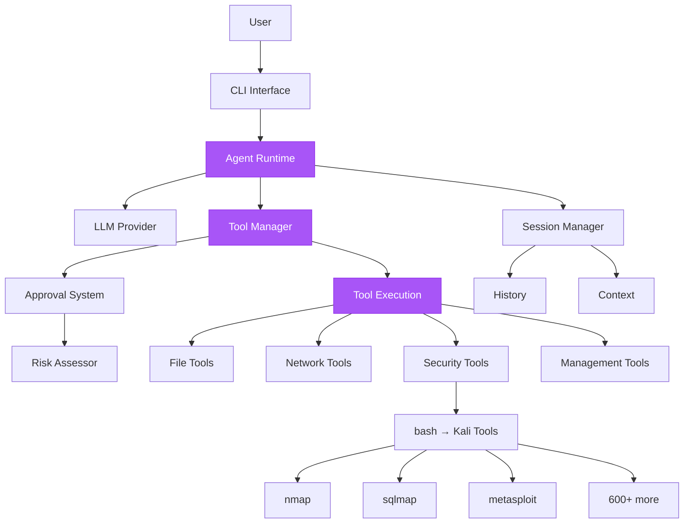
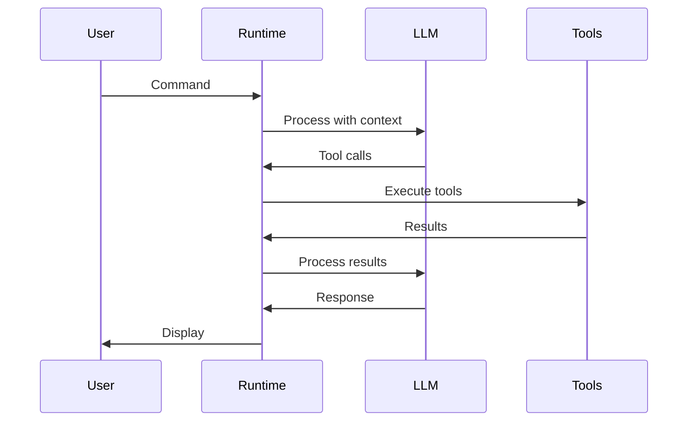
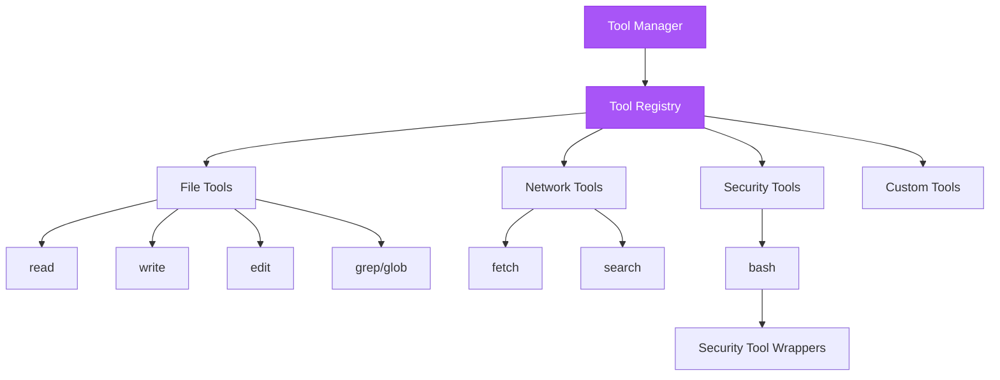
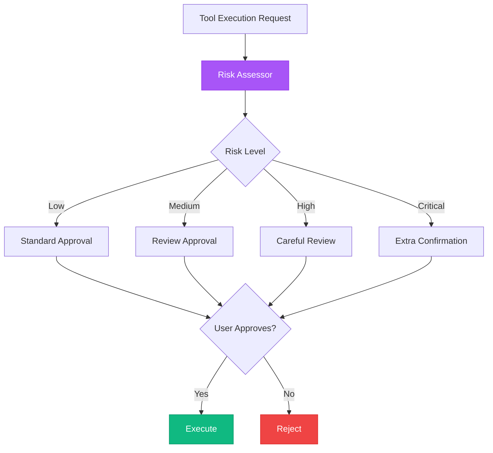
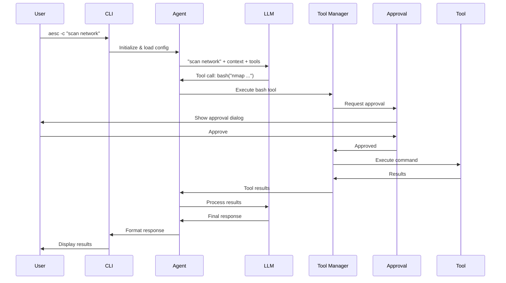
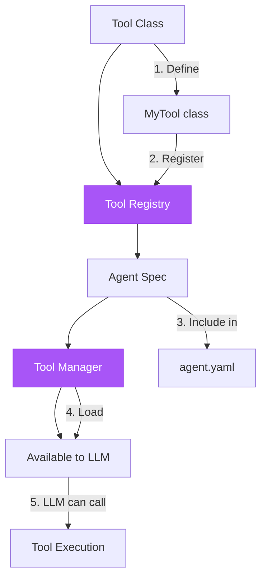
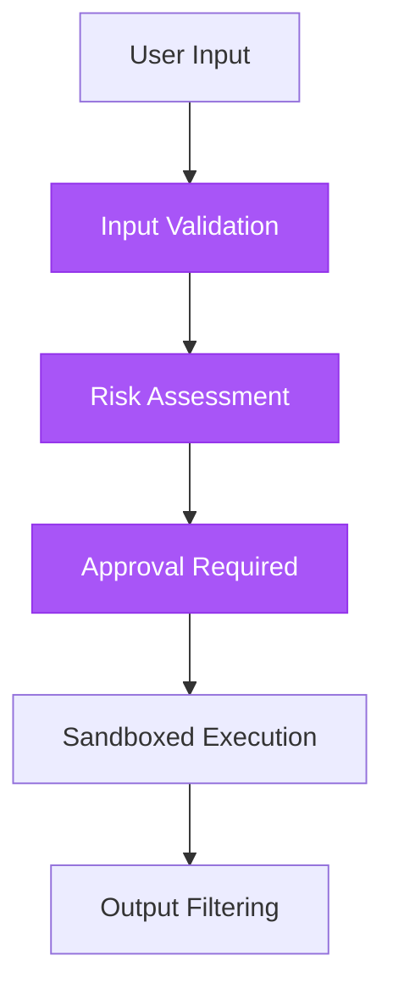
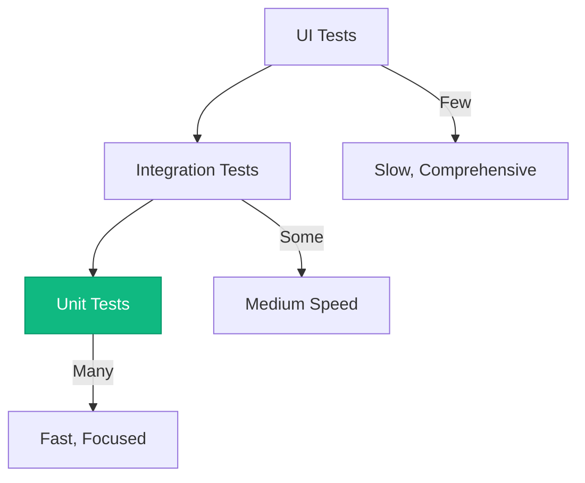

## System Overview

aesc is built on a clean, modular architecture designed for extensibility and security:



## Core Components

### CLI Interface

**Entry point** for user interaction:

```python
# src/aesc/cli.py

def cli(args: list[str]):
    """Main CLI entry point"""
    # Parse arguments
    config = load_config()

    # Initialize agent
    agent = load_agent(config.default_agent)

    # Run in appropriate mode
    if args:
        # Command mode
        result = await agent.run(args[0])
    else:
        # Interactive mode
        await interactive_shell(agent)
```

**Responsibilities:**
- Command-line argument parsing
- Configuration loading
- Mode selection (interactive vs command)
- Result formatting and display

### Agent Runtime

**Core orchestration** engine:



**Components:**
- **Agent Loader** - Loads agent specifications
- **Runtime Loop** - Main execution loop
- **Context Manager** - Maintains conversation context
- **Response Processor** - Parses LLM responses

**Location:** `src/aesc/soul/`

### LLM Abstraction

**Provider-agnostic** interface:

```python
# src/aesc/llm.py

class LLMProvider:
    """Abstract LLM provider"""

    async def complete(
        self,
        messages: list[Message],
        tools: list[ToolSpec]
    ) -> Response:
        """Generate completion"""
        pass

class AnthropicProvider(LLMProvider):
    """Anthropic Claude implementation"""
    pass

class OpenAIProvider(LLMProvider):
    """OpenAI implementation"""
    pass

class OllamaProvider(LLMProvider):
    """Ollama implementation"""
    pass
```

**Benefits:**
- Easy to add new providers
- Consistent interface
- Provider-specific optimizations

### Tool System

**Extensible tool framework:**



**Tool Interface:**
```python
class CallableTool2[T]:
    """Base tool interface"""

    name: str                    # Unique identifier
    description: str             # What tool does
    params: Type[T]              # Pydantic model

    async def __call__(self, params: T) -> dict:
        """Execute tool"""
        pass
```

**Tool Categories:**
1. **File Operations** - read, write, edit, grep, glob
2. **Network** - fetch, search
3. **Security** - bash (wraps security tools)
4. **Management** - SetTodoList, task tracking

### Approval System

**Security-first** command approval:



**Components:**
- **Risk Assessor** - Calculates risk level
- **Pattern Detector** - Identifies dangerous patterns
- **Approval Dialog** - User interface
- **Session Cache** - Remembers approvals

**Location:** `src/aesc/soul/approval.py`

### Session Management

**Context-aware** conversations:

```python
class SessionManager:
    """Manage conversation sessions"""

    def __init__(self):
        self.history: list[Message] = []
        self.context: dict[str, Any] = {}

    def add_message(self, message: Message):
        """Add message to history"""
        self.history.append(message)

        # Trim if too large
        if len(self.history) > MAX_HISTORY:
            self.history = self.history[-MAX_HISTORY:]

    def get_context(self) -> list[Message]:
        """Get conversation context"""
        return self.history

    def clear(self):
        """Clear session"""
        self.history.clear()
        self.context.clear()
```

**Features:**
- Message history
- Context window management
- Session persistence
- History trimming

## Data Flow

### Command Execution Flow



### Tool Registration Flow



## Design Principles

### 1. Security First

**Every action requires approval:**
```python
# Before execution
if not await approval.request(...):
    return ToolRejectedError()

# Then execute
result = await execute_command()
```

**Risk-based approvals:**
- Low risk → Quick approval
- Critical risk → Extra confirmation

### 2. Extensibility

**Easy to add:**
- New tools (implement interface)
- New agents (create YAML spec)
- New providers (implement LLMProvider)

```python
# Add new tool
class MyTool(CallableTool2[Params]):
    pass

# Register
tools.register(MyTool)

# Use in agent
# agent.yaml: tools: [my_tool]
```

### 3. LLM Agnostic

**Works with any LLM:**
```yaml
providers:
  anthropic: ...
  openai: ...
  ollama: ...
```

**Consistent interface:**
```python
# Same code works with all
result = await llm.complete(messages, tools)
```

### 4. Modular Design

**Clear separation:**
- CLI → User interface
- Agent → Orchestration
- Tools → Functionality
- LLM → Intelligence

**Each module:**
- Single responsibility
- Well-defined interfaces
- Independently testable

## Performance Considerations

### Context Management

**Challenge:** LLM context limits

**Solution:**
```python
# Trim old messages
if len(history) > MAX_CONTEXT:
    history = history[-MAX_CONTEXT:]

# Summarize long conversations
if context_size > THRESHOLD:
    summary = await llm.summarize(history)
    history = [summary] + recent_messages
```

### Tool Execution

**Native subprocess** for security tools:
```python
# Direct execution (fast)
process = await asyncio.create_subprocess_shell(
    command,
    stdout=asyncio.subprocess.PIPE,
    stderr=asyncio.subprocess.PIPE
)

# No HTTP overhead
# No MCP complexity
```

**Benchmark:**
- Tool overhead: `<10ms`
- Docker overhead: ~2% (~44ms for nmap)

### Caching

**LLM response caching:**
```python
@lru_cache(maxsize=100)
def get_tool_description(tool_name: str) -> str:
    """Cache tool descriptions"""
    pass
```

## Security Architecture

### Defense in Depth



**Layers:**
1. **Input Validation** - Pydantic models
2. **Risk Assessment** - Pattern detection
3. **User Approval** - Human in the loop
4. **Sandboxed Execution** - Docker isolation
5. **Output Filtering** - Sanitize results

### Isolation

**Docker containers:**
```dockerfile
# Kali Linux base
FROM kalilinux/kali-rolling

# Isolated environment
# Network controls
# Resource limits
```

**Benefits:**
- Tools isolated from host
- Network can be restricted
- Clean slate for each run

## Scalability

### Current Limitations

- Single-user design
- Sequential tool execution
- In-memory session storage

### Future Improvements

**Multi-user support:**
```python
# User-specific sessions
session_manager.get_session(user_id)

# Per-user config
config.load_for_user(user_id)
```

**Parallel execution:**
```python
# Execute multiple tools concurrently
results = await asyncio.gather(
    tool1.execute(params1),
    tool2.execute(params2)
)
```

**Persistent storage:**
```python
# Redis for sessions
session_store = RedisStore()

# Database for history
history_db = PostgreSQLStore()
```

## Testing Architecture

### Test Pyramid



**Strategy:**
- **Many unit tests** - Fast, focused
- **Some integration tests** - Key workflows
- **Few UI tests** - Critical paths

### Mocking

```python
# Mock LLM
class MockLLM:
    async def complete(self, messages, tools):
        return MockResponse()

# Mock approval
class MockApproval:
    async def request(self, *args):
        return True  # Always approve

# Test with mocks
async def test_tool():
    tool = MyTool(MockApproval(), MockBash())
    result = await tool(params)
    assert result["success"]
```

## Next Steps

<CardGroup cols={2}>
  <Card
    title="Development Guide"
    icon="code"
    href="/advanced/development"
  >
    Build on aesc architecture
  </Card>
  <Card
    title="Contributing"
    icon="hand-holding-heart"
    href="/advanced/contributing"
  >
    Contribute to the project
  </Card>
  <Card
    title="API Reference"
    icon="book"
    href="/api-reference/overview"
  >
    Detailed API documentation
  </Card>
  <Card
    title="Tools"
    icon="wrench"
    href="/api-reference/tools"
  >
    Tool system reference
  </Card>
</CardGroup>
