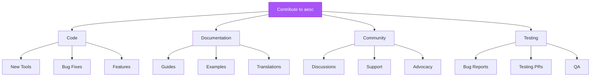

## Ways to Contribute



<CardGroup cols={2}>
  <Card title="Code Contributions" icon="code">
    New features, bug fixes, tools
  </Card>
  <Card title="Documentation" icon="book">
    Guides, examples, translations
  </Card>
  <Card title="Community Support" icon="users">
    Help others, answer questions
  </Card>
  <Card title="Testing & QA" icon="vial">
    Report bugs, test features
  </Card>
</CardGroup>

## Getting Started

<Steps>
  <Step title="Read the Code of Conduct">
    We're committed to a welcoming environment.

    [Code of Conduct →](https://github.com/akaeli-aesc/aesc-cli/blob/main/CODE_OF_CONDUCT.md)
  </Step>

  <Step title="Set Up Development Environment">
    ```bash
    # Fork repository on GitHub
    # Clone your fork
    git clone https://github.com/YOUR_USERNAME/aesc-cli.git
    cd aesc-cli

    # Install dependencies
    uv sync

    # Run tests
    uv run python -m pytest tests/
    ```
  </Step>

  <Step title="Find Something to Work On">
    **Good first issues:**
    - [github.com/akaeli-aesc/aesc-cli/labels/good-first-issue](https://github.com/akaeli-aesc/aesc-cli/issues?q=label%3A%22good+first+issue%22)

    **Or propose new feature:**
    - Open a discussion first
    - Get feedback before coding
  </Step>

  <Step title="Make Your Changes">
    - Create a branch
    - Write code + tests
    - Update documentation
    - Test thoroughly
  </Step>

  <Step title="Submit Pull Request">
    - Push to your fork
    - Open PR to `main` branch
    - Fill PR template
    - Respond to feedback
  </Step>
</Steps>

## Code Contributions

### Branch Naming

```bash
# Feature
git checkout -b feature/add-sqlmap-tool

# Bug fix
git checkout -b fix/approval-system-bug

# Documentation
git checkout -b docs/update-quickstart

# Refactoring
git checkout -b refactor/tool-interface
```

### Commit Messages

Follow [Conventional Commits](https://www.conventionalcommits.org/):

```bash
# Format
<type>(<scope>): <subject>

# Examples
feat(tools): add sqlmap integration
fix(approval): handle rejection properly
docs(guides): add docker troubleshooting
refactor(runtime): simplify tool loading
test(tools): add bash tool tests
```

**Types:**
- `feat` - New feature
- `fix` - Bug fix
- `docs` - Documentation
- `refactor` - Code refactoring
- `test` - Tests
- `chore` - Maintenance

### Code Style

<Tabs>
  <Tab title="Formatting">
    ```bash
    # Format with ruff
    uv run ruff format src/

    # Check style
    uv run ruff check src/

    # Fix issues
    uv run ruff check --fix src/
    ```

    **Configuration:**
    ```toml
    # pyproject.toml
    [tool.ruff]
    line-length = 100

    [tool.ruff.lint]
    select = ["E", "F", "UP", "B", "SIM", "I"]
    ```
  </Tab>

  <Tab title="Type Hints">
    ```python
    # Always use type hints
    def process_result(data: dict[str, Any]) -> str:
        """Process tool result"""
        return data.get("output", "")

    # Async functions
    async def fetch_data(url: str) -> dict:
        """Fetch data from URL"""
        pass

    # Optional parameters
    def scan_target(
        target: str,
        ports: str | None = None
    ) -> dict:
        """Scan target"""
        pass
    ```

    **Check types:**
    ```bash
    uv run pyright src/
    ```
  </Tab>

  <Tab title="Documentation">
    ```python
    class MyTool(CallableTool2[MyParams]):
        """
        One-line summary of what tool does.

        Detailed description explaining:
        - What the tool does
        - When to use it
        - Important considerations

        Example:
            ```python
            tool = MyTool(approval, bash)
            result = await tool(MyParams(target="example.com"))
            ```

        Args:
            approval: Approval system instance
            bash: Bash tool for execution

        Returns:
            Tool execution result dictionary
        """
        pass
    ```
  </Tab>
</Tabs>

### Writing Tests

<Tabs>
  <Tab title="Unit Tests">
    ```python
    # tests/test_my_tool.py

    import pytest
    from aesc.tools.my_tool import MyTool, MyParams

    @pytest.mark.asyncio
    async def test_my_tool_success():
        """Test successful execution"""
        # Arrange
        approval = MockApproval(always_approve=True)
        bash = MockBash(return_value={
            "success": True,
            "output": "Expected output"
        })
        tool = MyTool(approval, bash)

        # Act
        result = await tool(MyParams(target="example.com"))

        # Assert
        assert result["success"] is True
        assert "output" in result
        assert result["output"] == "Expected output"
    ```
  </Tab>

  <Tab title="Integration Tests">
    ```python
    @pytest.mark.asyncio
    async def test_tool_chain():
        """Test multiple tools working together"""
        agent = load_agent("default")

        # Execute command
        result = await agent.run("scan example.com")

        # Verify result
        assert result["success"] is True
        assert "findings" in result
    ```
  </Tab>

  <Tab title="Mock Objects">
    ```python
    class MockApproval:
        def __init__(self, always_approve=True):
            self.always_approve = always_approve

        async def request(self, tool, action, details):
            return self.always_approve

    class MockBash:
        def __init__(self, return_value):
            self.return_value = return_value

        async def __call__(self, params):
            return self.return_value
    ```
  </Tab>
</Tabs>

### Running Tests

```bash
# All tests
uv run python -m pytest tests/ -v

# Specific file
uv run python -m pytest tests/test_my_tool.py

# With coverage
uv run python -m pytest tests/ --cov=src/aesc --cov-report=html

# Watch mode
uv run pytest-watch tests/
```

## Documentation Contributions

### Documentation Structure

```
docs/
├── introduction.mdx           # Getting started
├── quickstart.mdx             # 5-minute guide
├── installation.mdx           # Installation
├── configuration.mdx          # Configuration
│
├── guides/                    # How-to guides
│   ├── docker-usage.mdx
│   ├── llm-providers.mdx
│   └── security-best-practices.mdx
│
├── api-reference/             # API docs
│   ├── cli-commands.mdx
│   ├── agents.mdx
│   └── tools.mdx
│
├── features/                  # Feature docs
│   └── risk-based-approvals.mdx
│
└── advanced/                  # Advanced topics
    ├── development.mdx
    ├── contributing.mdx
    └── architecture.mdx
```

### Writing Documentation

<Tabs>
  <Tab title="MDX Format">
    ```mdx
    ---
    title: Page Title
    description: 'One-line description'
    icon: 'icon-name'
    ---

    ## Section Heading

    Content with **formatting**.

    <Info>
      Information callout
    </Info>

    <Warning>
      Warning callout
    </Warning>

    ### Code Examples

    \`\`\`bash
    aesc -c "scan network"
    \`\`\`
    ```
  </Tab>

  <Tab title="Components">
    ```mdx
    ## Tabs

    <Tabs>
      <Tab title="Option 1">
        Content for option 1
      </Tab>
      <Tab title="Option 2">
        Content for option 2
      </Tab>
    </Tabs>

    ## Accordion

    <AccordionGroup>
      <Accordion title="Question">
        Answer
      </Accordion>
    </AccordionGroup>

    ## Steps

    <Steps>
      <Step title="First">
        Do this first
      </Step>
      <Step title="Second">
        Then do this
      </Step>
    </Steps>
    ```
  </Tab>

  <Tab title="Mermaid Diagrams">
    ```mermaid
    graph TD
        A[Start] --> B{Decision}
        B -->|Yes| C[Action 1]
        B -->|No| D[Action 2]

        style A fill:#A855F7,stroke:#9333EA,color:#fff
    ```

    **Common diagrams:**
    - Flowcharts (`graph TD`)
    - Sequence (`sequenceDiagram`)
    - Class diagrams (`classDiagram`)
  </Tab>
</Tabs>

### Documentation Guidelines

<CardGroup cols={2}>
  <Card title="Be Clear" icon="lightbulb">
    Use simple language, avoid jargon
  </Card>
  <Card title="Add Examples" icon="code">
    Show code examples for concepts
  </Card>
  <Card title="Use Visuals" icon="image">
    Mermaid diagrams for flows
  </Card>
  <Card title="Test Commands" icon="check">
    Verify all commands work
  </Card>
</CardGroup>

## Community Contributions

### Helping Others

**Where to help:**
- GitHub Discussions
- GitHub Issues
- Stack Overflow

**How to help:**
1. Answer questions clearly
2. Provide code examples
3. Link to documentation
4. Be patient and respectful

### Reporting Bugs

**Good bug report:**
```markdown
## Bug Description
Clear description of the issue

## Steps to Reproduce
1. Run command X
2. See error Y
3. Expected Z

## Environment
- aesc version: 0.1.0-beta
- OS: Ubuntu 22.04
- Docker: 24.0.0
- LLM: Claude Sonnet 4.5

## Error Messages
```
Paste full error message
```

## Logs
```
Paste relevant logs
```

## Additional Context
Any other relevant information
```

### Feature Requests

**Good feature request:**
```markdown
## Feature Description
Clear description of proposed feature

## Use Case
Why is this feature needed?
What problem does it solve?

## Proposed Solution
How could this be implemented?

## Alternatives Considered
What other approaches were considered?

## Additional Context
Examples, mockups, related features
```

## Pull Request Process

<Steps>
  <Step title="Before Submitting">
    **Checklist:**
    - [ ] Tests pass locally
    - [ ] Code is formatted (`ruff format`)
    - [ ] Types check (`pyright`)
    - [ ] Documentation updated
    - [ ] Changelog updated (if needed)
    - [ ] Commits follow convention
  </Step>

  <Step title="PR Template">
    ```markdown
    ## Description
    What does this PR do?

    ## Related Issue
    Fixes #123

    ## Type of Change
    - [ ] Bug fix
    - [ ] New feature
    - [ ] Breaking change
    - [ ] Documentation

    ## Testing
    How was this tested?

    ## Checklist
    - [ ] Tests pass
    - [ ] Docs updated
    - [ ] Follows style guide
    ```
  </Step>

  <Step title="Review Process">
    **What to expect:**
    - Maintainer review within 1-3 days
    - Feedback and requested changes
    - CI checks must pass
    - At least 1 approval needed

    **Responding to feedback:**
    - Address all comments
    - Push new commits (don't force-push)
    - Explain reasoning if disagreeing
  </Step>

  <Step title="Merging">
    **After approval:**
    - Maintainer will merge
    - PR will be closed
    - Changes in next release
    - You'll be credited!
  </Step>
</Steps>

## Development Resources

<CardGroup cols={2}>
  <Card title="Development Guide" icon="code">
    [Development Setup →](/advanced/development)
  </Card>
  <Card title="Architecture" icon="sitemap">
    [System Architecture →](/advanced/architecture)
  </Card>
  <Card title="API Reference" icon="book">
    [API Docs →](/api-reference/overview)
  </Card>
  <Card title="GitHub Repo" icon="github">
    [Source Code →](https://github.com/akaeli-aesc/aesc-cli)
  </Card>
</CardGroup>

## Recognition

**Contributors are recognized:**
- Listed in CONTRIBUTORS.md
- Mentioned in release notes
- GitHub contributor badge
- Our eternal gratitude! 🙏

## Questions?

**Get help:**
- GitHub Discussions (Q&A)
- Email: security@akæli.com

## License

By contributing, you agree that your contributions will be licensed under the Apache License 2.0.

---

**Thank you for contributing to aesc!** 🎉

Every contribution, no matter how small, makes aesc better for the security community.
