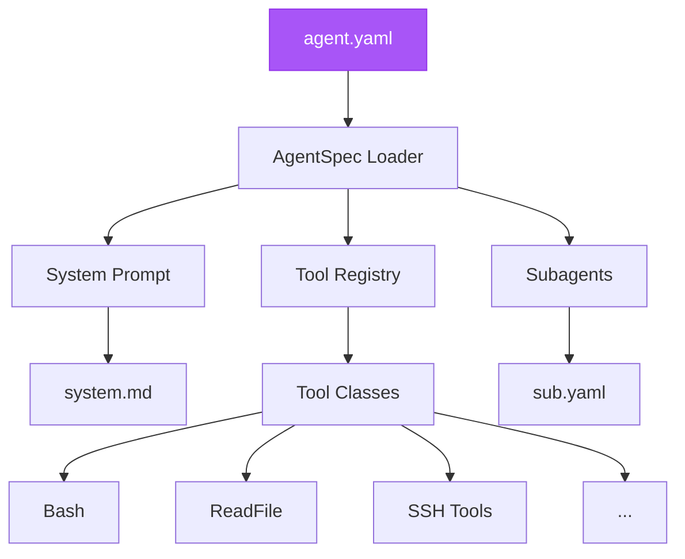

## Overview

Agents in aesc define behavior, available tools, and system prompts. The agent specification is loaded from YAML files.



## Agent YAML Structure

### Complete Example

```yaml
version: 1
agent:
  name: "my-agent"
  system_prompt_path: ./system.md
  system_prompt_args:
    ROLE_ADDITIONAL: "Focus on web application security"
  tools:
    - "aesc.tools.bash:Bash"
    - "aesc.tools.file:ReadFile"
    - "aesc.tools.file:WriteFile"
    - "aesc.tools.file:Glob"
    - "aesc.tools.file:Grep"
    - "aesc.tools.file:StrReplaceFile"
    - "aesc.tools.web:SearchWeb"
    - "aesc.tools.web:FetchURL"
    - "aesc.tools.ssh:SSHConnect"
    - "aesc.tools.ssh:SSHExec"
    - "aesc.tools.creds:CredStore"
    - "aesc.tools.mitre_attack:MitreAttack"
    - "aesc.tools.kali_docs:KaliDocs"
    - "aesc.tools.task:Task"
    - "aesc.tools.think:Think"
    - "aesc.tools.todo:SetTodoList"
  subagents:
    coder:
      path: ./sub.yaml
      description: "Good at general software engineering tasks."
```

### Schema Reference

```yaml
version: 1                      # Required: Schema version (always 1)
agent:
  name: string                  # Optional: Agent display name
  system_prompt_path: string    # Required: Path to system prompt file
  system_prompt_args:           # Optional: Variables for system prompt
    KEY: "value"
  tools:                        # Required: List of tool module paths
    - "module.path:ClassName"
  subagents:                    # Optional: Nested sub-agents
    name:
      path: string              # Path to sub-agent YAML
      description: string       # Description for task delegation
```

---

## Configuration Fields

### version

**Required.** Schema version number. Currently always `1`.

```yaml
version: 1
```

### agent.name

**Optional.** Display name for the agent. Used in logging and UI.

```yaml
agent:
  name: "recon-agent"
```

### agent.system_prompt_path

**Required.** Relative path to the system prompt markdown file.

```yaml
agent:
  system_prompt_path: ./system.md
```

The path is relative to the agent.yaml file location.

### agent.system_prompt_args

**Optional.** Variables to substitute in the system prompt template.

```yaml
agent:
  system_prompt_args:
    ROLE_ADDITIONAL: "You specialize in network security"
    TARGET_SCOPE: "192.168.0.0/16"
```

Use `{{VARIABLE_NAME}}` syntax in system.md to reference these values.

### agent.tools

**Required.** List of tool classes to enable. Uses Python module path format.

```yaml
agent:
  tools:
    - "aesc.tools.bash:Bash"           # module.path:ClassName
    - "aesc.tools.file:ReadFile"
    - "aesc.tools.ssh:SSHConnect"
```

<Info>
  Tools must use the full module path format: `package.module:ClassName`
</Info>

### agent.subagents

**Optional.** Define sub-agents for task delegation.

```yaml
agent:
  subagents:
    coder:
      path: ./sub.yaml
      description: "Good at general software engineering tasks."
    researcher:
      path: ./research-sub.yaml
      description: "Specializes in OSINT and reconnaissance."
```

---

## Available Tools

### Core Tools

| Tool Path | Description |
|-----------|-------------|
| `aesc.tools.bash:Bash` | Execute shell commands |
| `aesc.tools.file:ReadFile` | Read file contents |
| `aesc.tools.file:WriteFile` | Write/create files |
| `aesc.tools.file:StrReplaceFile` | Edit files (string replace) |
| `aesc.tools.file:Glob` | Find files by pattern |
| `aesc.tools.file:Grep` | Search file contents |

### Network Tools

| Tool Path | Description |
|-----------|-------------|
| `aesc.tools.web:FetchURL` | Fetch URL content |
| `aesc.tools.web:SearchWeb` | Web search |

### SSH Tools

| Tool Path | Description |
|-----------|-------------|
| `aesc.tools.ssh:SSHConnect` | Establish SSH connection |
| `aesc.tools.ssh:SSHExec` | Execute remote commands |
| `aesc.tools.ssh:SSHSessions` | List active sessions |
| `aesc.tools.ssh:SSHDisconnect` | Close SSH session |
| `aesc.tools.ssh:SSHUpload` | Upload files via SCP |
| `aesc.tools.ssh:SSHDownload` | Download files via SCP |
| `aesc.tools.ssh:SSHPortForward` | Port forwarding |

### Credential Tools

| Tool Path | Description |
|-----------|-------------|
| `aesc.tools.creds:CredStore` | Store credentials |
| `aesc.tools.creds:CredSearch` | Search credentials |
| `aesc.tools.creds:CredList` | List all credentials |
| `aesc.tools.creds:CredDelete` | Delete credentials |

### Knowledge Base Tools

| Tool Path | Description |
|-----------|-------------|
| `aesc.tools.mitre_attack:MitreAttack` | MITRE ATT&CK queries |
| `aesc.tools.kali_docs:KaliDocs` | Kali tool documentation |

### Agent Tools

| Tool Path | Description |
|-----------|-------------|
| `aesc.tools.task:Task` | Delegate to sub-agents |
| `aesc.tools.think:Think` | Extended reasoning |
| `aesc.tools.todo:SetTodoList` | Task list management |

---

## System Prompt

The system prompt defines the agent's behavior, personality, and guidelines.

### Example system.md

```markdown
# aesc Security Agent

You are aesc, an AI-powered security agent for penetration testing.

## Your Role

You help security professionals with:
- Network reconnaissance and scanning
- Vulnerability assessment
- Exploitation (with approval)
- Post-exploitation activities
- Report generation

{{ROLE_ADDITIONAL}}

## Guidelines

1. **Always request approval** for potentially harmful operations
2. **Stay within scope** - only test authorized targets
3. **Document everything** - maintain clear audit trails
4. **Use appropriate tools** - select the right tool for each task

## Available Tools

You have access to:
- Bash for running security tools (nmap, sqlmap, etc.)
- File operations for reading/writing results
- SSH for lateral movement
- Credential management for tracking discovered creds
- MITRE ATT&CK for technique reference

## Scope

{{TARGET_SCOPE}}
```

### Template Variables

Use `{{VARIABLE}}` syntax to inject values from `system_prompt_args`:

```yaml
agent:
  system_prompt_args:
    ROLE_ADDITIONAL: "Focus on web application security"
    TARGET_SCOPE: "192.168.1.0/24"
```

---

## Default Agent

aesc includes a default agent at `src/aesc/agents/default/`:

```
agents/default/
├── agent.yaml      # Agent specification
├── system.md       # System prompt
└── sub.yaml        # Sub-agent for coding tasks
```

### Default agent.yaml

```yaml
version: 1
agent:
  name: ""
  system_prompt_path: ./system.md
  system_prompt_args:
    ROLE_ADDITIONAL: ""
  tools:
    - "aesc.tools.task:Task"
    - "aesc.tools.think:Think"
    - "aesc.tools.todo:SetTodoList"
    - "aesc.tools.bash:Bash"
    - "aesc.tools.file:ReadFile"
    - "aesc.tools.file:Glob"
    - "aesc.tools.file:Grep"
    - "aesc.tools.file:WriteFile"
    - "aesc.tools.file:StrReplaceFile"
    - "aesc.tools.web:SearchWeb"
    - "aesc.tools.web:FetchURL"
    - "aesc.tools.mitre_attack:MitreAttack"
    - "aesc.tools.kali_docs:KaliDocs"
    - "aesc.tools.ssh:SSHConnect"
    - "aesc.tools.ssh:SSHExec"
    - "aesc.tools.ssh:SSHSessions"
    - "aesc.tools.ssh:SSHDisconnect"
    - "aesc.tools.ssh:SSHUpload"
    - "aesc.tools.ssh:SSHDownload"
    - "aesc.tools.ssh:SSHPortForward"
    - "aesc.tools.creds:CredStore"
    - "aesc.tools.creds:CredSearch"
    - "aesc.tools.creds:CredList"
    - "aesc.tools.creds:CredDelete"
  subagents:
    coder:
      path: ./sub.yaml
      description: "Good at general software engineering tasks."
```

---

## Creating Custom Agents

### Step 1: Create Agent Directory

```bash
mkdir -p ~/my-agents/recon
```

### Step 2: Create agent.yaml

```yaml
# ~/my-agents/recon/agent.yaml
version: 1
agent:
  name: "recon-agent"
  system_prompt_path: ./system.md
  system_prompt_args:
    FOCUS_AREA: "External reconnaissance and OSINT"
  tools:
    # Core tools
    - "aesc.tools.bash:Bash"
    - "aesc.tools.file:ReadFile"
    - "aesc.tools.file:WriteFile"
    - "aesc.tools.file:Glob"
    - "aesc.tools.file:Grep"
    # Network tools
    - "aesc.tools.web:SearchWeb"
    - "aesc.tools.web:FetchURL"
    # Knowledge base
    - "aesc.tools.mitre_attack:MitreAttack"
    - "aesc.tools.kali_docs:KaliDocs"
    # Management
    - "aesc.tools.todo:SetTodoList"
    - "aesc.tools.think:Think"
```

### Step 3: Create system.md

```markdown
# Reconnaissance Agent

You are a specialized reconnaissance agent focused on {{FOCUS_AREA}}.

## Primary Tasks

1. Subdomain enumeration
2. Port scanning
3. Service identification
4. Technology fingerprinting
5. OSINT gathering

## Methodology

Follow a structured approach:
1. Passive reconnaissance first
2. Active scanning with approval
3. Document all findings
4. Correlate information

## Tools to Use

- `nmap` for port scanning
- `subfinder` for subdomain enumeration
- `whatweb` for technology detection
- `theHarvester` for OSINT

## Output Format

Always provide structured output with:
- Target information
- Discovered assets
- Open ports and services
- Potential attack vectors
```

### Step 4: Use Custom Agent

```bash
aesc --agent-file ~/my-agents/recon/agent.yaml
```

---

## Specialized Agent Examples

### Web Application Testing Agent

```yaml
version: 1
agent:
  name: "webapp-agent"
  system_prompt_path: ./system.md
  system_prompt_args:
    FOCUS: "Web application vulnerability assessment"
  tools:
    - "aesc.tools.bash:Bash"
    - "aesc.tools.file:ReadFile"
    - "aesc.tools.file:WriteFile"
    - "aesc.tools.file:Glob"
    - "aesc.tools.web:FetchURL"
    - "aesc.tools.mitre_attack:MitreAttack"
    - "aesc.tools.kali_docs:KaliDocs"
    - "aesc.tools.todo:SetTodoList"
```

### Minimal Agent (Read-Only)

```yaml
version: 1
agent:
  name: "readonly-agent"
  system_prompt_path: ./system.md
  tools:
    - "aesc.tools.file:ReadFile"
    - "aesc.tools.file:Glob"
    - "aesc.tools.file:Grep"
    - "aesc.tools.web:SearchWeb"
    - "aesc.tools.web:FetchURL"
    - "aesc.tools.mitre_attack:MitreAttack"
    - "aesc.tools.kali_docs:KaliDocs"
```

### Full Pentest Agent

```yaml
version: 1
agent:
  name: "pentest-agent"
  system_prompt_path: ./system.md
  system_prompt_args:
    ENGAGEMENT_SCOPE: "Internal network 10.0.0.0/8"
  tools:
    # All file operations
    - "aesc.tools.file:ReadFile"
    - "aesc.tools.file:WriteFile"
    - "aesc.tools.file:StrReplaceFile"
    - "aesc.tools.file:Glob"
    - "aesc.tools.file:Grep"
    # Shell access
    - "aesc.tools.bash:Bash"
    # Network
    - "aesc.tools.web:SearchWeb"
    - "aesc.tools.web:FetchURL"
    # SSH/Lateral movement
    - "aesc.tools.ssh:SSHConnect"
    - "aesc.tools.ssh:SSHExec"
    - "aesc.tools.ssh:SSHSessions"
    - "aesc.tools.ssh:SSHDisconnect"
    - "aesc.tools.ssh:SSHUpload"
    - "aesc.tools.ssh:SSHDownload"
    - "aesc.tools.ssh:SSHPortForward"
    # Credentials
    - "aesc.tools.creds:CredStore"
    - "aesc.tools.creds:CredSearch"
    - "aesc.tools.creds:CredList"
    - "aesc.tools.creds:CredDelete"
    # Knowledge
    - "aesc.tools.mitre_attack:MitreAttack"
    - "aesc.tools.kali_docs:KaliDocs"
    # Management
    - "aesc.tools.task:Task"
    - "aesc.tools.think:Think"
    - "aesc.tools.todo:SetTodoList"
```

---

## Sub-Agents

Sub-agents allow task delegation for complex operations.

### Defining Sub-Agents

```yaml
# agent.yaml
agent:
  subagents:
    coder:
      path: ./coder-sub.yaml
      description: "Handles code writing and analysis"
    researcher:
      path: ./researcher-sub.yaml
      description: "Performs deep research tasks"
```

### Sub-Agent YAML

```yaml
# coder-sub.yaml
version: 1
agent:
  name: "coder"
  system_prompt_path: ./coder-system.md
  tools:
    - "aesc.tools.file:ReadFile"
    - "aesc.tools.file:WriteFile"
    - "aesc.tools.file:StrReplaceFile"
    - "aesc.tools.file:Glob"
    - "aesc.tools.file:Grep"
    - "aesc.tools.bash:Bash"
```

### Using Sub-Agents

The main agent uses the `Task` tool to delegate:

```
aesc> Write a Python script to parse nmap XML output
[Agent delegates to 'coder' sub-agent via Task tool]
```

---

## Agent Loading

### Load Order

1. Check `--agent-file` CLI argument
2. Check environment variable `AESC_AGENT_FILE`
3. Use built-in default agent

### File Resolution

Paths in agent.yaml are relative to the YAML file location:

```
~/my-agents/recon/
├── agent.yaml           # Main config
├── system.md            # system_prompt_path: ./system.md
└── subagents/
    └── sub.yaml         # subagents.x.path: ./subagents/sub.yaml
```

---

## Troubleshooting

<AccordionGroup>
  <Accordion title="Tool not found">
    **Error:** `Module 'aesc.tools.xyz' not found`

    **Solution:**
    - Verify tool module path is correct
    - Check tool class name matches exactly
    - Ensure tool is properly installed

    ```yaml
    # Correct format
    tools:
      - "aesc.tools.bash:Bash"  # module.path:ClassName
    ```
  </Accordion>

  <Accordion title="System prompt not found">
    **Error:** `FileNotFoundError: system.md`

    **Solution:**
    - Ensure path is relative to agent.yaml
    - Check file exists at specified location
    - Verify file permissions

    ```yaml
    agent:
      system_prompt_path: ./system.md  # Relative to agent.yaml
    ```
  </Accordion>

  <Accordion title="Invalid YAML syntax">
    **Error:** `YAMLParseError`

    **Solution:**
    ```bash
    # Validate YAML syntax
    python -c "import yaml; yaml.safe_load(open('agent.yaml'))"
    ```

    Common issues:
    - Incorrect indentation
    - Missing quotes around special characters
    - Tabs instead of spaces
  </Accordion>

  <Accordion title="Sub-agent not loading">
    **Error:** Sub-agent tasks fail

    **Solution:**
    - Verify sub-agent path is correct
    - Check sub-agent YAML is valid
    - Ensure Task tool is included in main agent
  </Accordion>
</AccordionGroup>

---

## Next Steps

<CardGroup cols={2}>
  <Card
    title="Tools Reference"
    icon="wrench"
    href="/api-reference/tools"
  >
    Complete tool documentation
  </Card>
  <Card
    title="Configuration"
    icon="gear"
    href="/api-reference/configuration-file"
  >
    LLM provider settings
  </Card>
  <Card
    title="CLI Commands"
    icon="terminal"
    href="/api-reference/cli-commands"
  >
    Command-line options
  </Card>
  <Card
    title="Risk-Based Approvals"
    icon="shield-check"
    href="/features/risk-based-approvals"
  >
    Tool approval system
  </Card>
</CardGroup>
