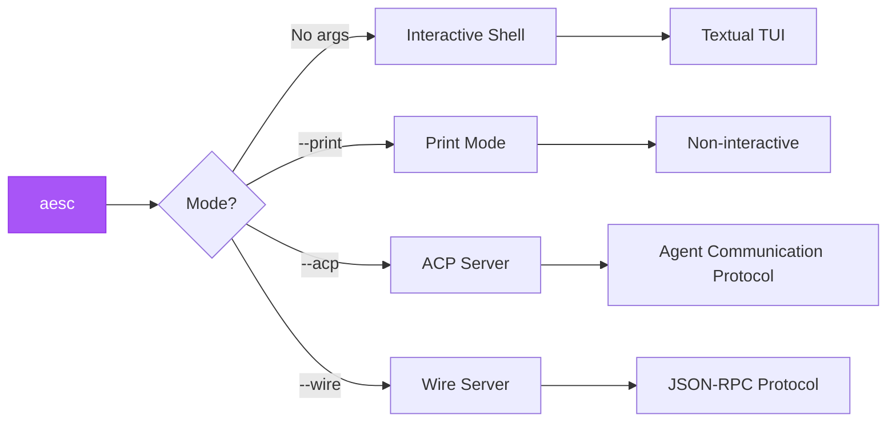

## Command Syntax

```bash
aesc [OPTIONS] [COMMAND]
```



## Usage Modes

### Interactive Mode (Default)

Start the aesc shell for multi-turn conversations:

```bash
aesc
```

**Features:**
- Multi-turn conversations with context retention
- Rich Textual TUI interface
- Session management
- In-shell commands (`/help`, `/clear`, etc.)

**Example Session:**
```bash
$ aesc
aesc> scan 192.168.1.1 for open ports
[aesc executes nmap scan...]

aesc> what services are running?
[aesc analyzes previous results...]

aesc> save findings to /results
[aesc creates report...]

aesc> /exit
```

### Print Mode (Non-Interactive)

Execute commands without the interactive TUI:

```bash
aesc --print -c "your command here"
```

<Info>
  Print mode implicitly enables `--yolo` (auto-approve) since there's no user interaction.
</Info>

**Use cases:**
- Automation scripts
- CI/CD pipelines
- Piping input/output

**Example:**
```bash
# Single command execution
aesc --print -c "scan 192.168.1.1 and list open ports"

# Pipe input
echo "analyze this log file" | aesc --print --input-format text

# JSON output for parsing
aesc --print --output-format stream-json -c "scan network"
```

### ACP Server Mode

Run as an Agent Communication Protocol server:

```bash
aesc --acp
```

**Use cases:**
- Integration with external tools
- IDE extensions
- Custom frontends

### Wire Server Mode (Experimental)

Run as a JSON-RPC Wire protocol server:

```bash
aesc --wire
```

---

## Command-Line Options

### Basic Options

<Tabs>
  <Tab title="Help & Version">
    #### --help / -h

    Show help message:
    ```bash
    aesc --help
    aesc -h
    ```

    #### --version / -V

    Show aesc version:
    ```bash
    aesc --version
    aesc -V
    ```

    <Warning>
      Note: The short flag is uppercase `-V`, not lowercase `-v`.
    </Warning>
  </Tab>

  <Tab title="Model & Agent">
    #### --model / -m

    Specify the LLM model to use:
    ```bash
    aesc --model claude-sonnet-4-20250514
    aesc -m gpt-4
    ```

    Overrides the default model from config.

    #### --agent-file

    Use a custom agent specification file:
    ```bash
    aesc --agent-file /path/to/agent.yaml
    ```

    The file must be a valid agent YAML specification.
  </Tab>

  <Tab title="Working Directory">
    #### --work-dir / -w

    Set the working directory for the agent:
    ```bash
    aesc --work-dir /path/to/project
    aesc -w ~/my-project
    ```

    Default: Current directory
  </Tab>
</Tabs>

### Execution Options

<Tabs>
  <Tab title="Command Input">
    #### --command / -c / --query / -q

    Provide initial command/query to the agent:
    ```bash
    aesc -c "scan 192.168.1.1"
    aesc --command "find vulnerabilities"
    aesc -q "what is nmap?"
    ```

    In interactive mode, this runs the command and then enters the shell.
    In print mode, this runs the command and exits.
  </Tab>

  <Tab title="Session">
    #### --continue / -C

    Resume the previous session for the working directory:
    ```bash
    aesc --continue
    aesc -C
    ```

    **Behavior:**
    - Loads last session history
    - Continues conversation context
    - Shows previous messages

    <Info>
      Sessions are directory-specific. Each working directory has its own session history.
    </Info>
  </Tab>

  <Tab title="Auto-Approve">
    #### --yolo / --yes / -y / --auto-approve

    Automatically approve all tool executions:
    ```bash
    aesc --yolo
    aesc --yes
    aesc -y
    aesc --auto-approve
    ```

    <Warning>
      **Disables all safety checks!**

      Only use in:
      - Controlled lab environments
      - Automated testing pipelines
      - Trusted, isolated networks

      Never use on production or unauthorized targets!
    </Warning>
  </Tab>
</Tabs>

### Mode Options

<Tabs>
  <Tab title="Print Mode">
    #### --print

    Run in non-interactive print mode:
    ```bash
    aesc --print -c "scan network"
    ```

    **Notes:**
    - Implicitly enables `--yolo`
    - Output goes to stdout
    - No TUI interface
  </Tab>

  <Tab title="Server Modes">
    #### --acp

    Run as ACP (Agent Communication Protocol) server:
    ```bash
    aesc --acp
    ```

    #### --wire

    Run as Wire server (experimental JSON-RPC):
    ```bash
    aesc --wire
    ```

    <Info>
      Server modes ignore the `--command` argument if provided.
    </Info>
  </Tab>

  <Tab title="I/O Formats">
    #### --input-format

    Input format for print mode:
    ```bash
    aesc --print --input-format text
    aesc --print --input-format stream-json
    ```

    **Options:**
    - `text` (default) - Plain text input
    - `stream-json` - Streaming JSON input

    #### --output-format

    Output format for print mode:
    ```bash
    aesc --print --output-format text
    aesc --print --output-format stream-json
    ```

    **Options:**
    - `text` (default) - Plain text output
    - `stream-json` - Streaming JSON output (for parsing)
  </Tab>
</Tabs>

### Advanced Options

<Tabs>
  <Tab title="MCP Configuration">
    #### --mcp-config-file

    Load MCP (Model Context Protocol) configuration from file:
    ```bash
    aesc --mcp-config-file /path/to/mcp.json
    ```

    Can be specified multiple times for multiple configs:
    ```bash
    aesc --mcp-config-file config1.json --mcp-config-file config2.json
    ```

    #### --mcp-config

    Load MCP configuration from JSON string:
    ```bash
    aesc --mcp-config '{"servers": {...}}'
    ```
  </Tab>

  <Tab title="Debug Options">
    #### --verbose

    Print verbose information during startup:
    ```bash
    aesc --verbose
    ```

    Shows session creation, history file location, etc.

    #### --debug

    Enable debug logging:
    ```bash
    aesc --debug
    ```

    **Enables:**
    - Detailed trace-level logging
    - Full stack traces on errors
    - Internal library debug logs

    Logs are written to `~/.aesc/logs/aesc.log`
  </Tab>

  <Tab title="Thinking Mode">
    #### --thinking

    Enable extended thinking mode (if supported by the model):
    ```bash
    aesc --thinking
    ```

    Allows the model to perform more complex reasoning.
  </Tab>
</Tabs>

---

## In-Shell Commands

Commands available inside the interactive shell (prefix with `/`):

### /help

Show available commands:
```bash
aesc> /help
```

### /clear

Clear conversation history and start fresh:
```bash
aesc> /clear
```

**Effect:**
- Clears message context
- Resets conversation
- Keeps configuration

### /compact

Compact the conversation history to reduce token usage:
```bash
aesc> /compact
```

### /exit or /quit

Exit aesc:
```bash
aesc> /exit
aesc> /quit
```

You can also use `Ctrl+D` or `Ctrl+C` to exit.

---

## Environment Variables

Configure aesc via environment variables:

<Tabs>
  <Tab title="LLM Provider">
    ### Anthropic Claude (Recommended)

    ```bash
    export ANTHROPIC_API_KEY=sk-ant-your-key
    aesc
    ```

    ### OpenAI

    ```bash
    export OPENAI_API_KEY=sk-your-key
    aesc
    ```

    ### Ollama (Local)

    ```bash
    export OLLAMA_BASE_URL=http://localhost:11434/v1
    aesc
    ```

    ### Custom Provider

    ```bash
    export AESC_API_KEY=your-key
    export AESC_BASE_URL=https://your-api.com/v1
    aesc
    ```
  </Tab>

  <Tab title="Model Selection">
    ### Override Model

    ```bash
    export AESC_MODEL_NAME=claude-sonnet-4-20250514
    aesc
    ```

    This overrides the default model from configuration.
  </Tab>

  <Tab title="Behavior">
    ### Auto-Approval (YOLO Mode)

    ```bash
    export AESC_YOLO_MODE=1
    aesc
    ```

    <Warning>
      Disables all safety checks - use with caution!
    </Warning>
  </Tab>
</Tabs>

**Priority Order:**
1. Command-line flags (highest)
2. Environment variables
3. Configuration file
4. Defaults (lowest)

---

## Exit Codes

| Code | Meaning | Description |
|------|---------|-------------|
| `0` | Success | Command completed successfully |
| `1` | Error | General error occurred |

**Example:**
```bash
aesc --print -c "scan network" && echo "Success" || echo "Failed with code $?"
```

---

## Usage Examples

### Basic Scanning

```bash
# Interactive mode
aesc
aesc> scan 192.168.1.1 for open ports

# Command mode with print
aesc --print -c "scan 192.168.1.1 for open ports"

# Auto-approve mode
aesc --yolo -c "scan 192.168.1.1"
```

### Continue Previous Session

```bash
# Start a session
aesc -w ~/pentest/project1
aesc> scan 192.168.1.0/24
aesc> /exit

# Continue later
aesc -w ~/pentest/project1 --continue
aesc> analyze the scan results from before
```

### Automation Scripts

```bash
#!/bin/bash
# security-check.sh

TARGET=$1
REPORT=/results/$(date +%Y%m%d)-${TARGET}.txt

aesc --print --yolo -c "scan ${TARGET} and save report to ${REPORT}"

if [ $? -eq 0 ]; then
    echo "Scan completed: ${REPORT}"
else
    echo "Scan failed"
    exit 1
fi
```

### CI/CD Integration

```yaml
# .github/workflows/security-scan.yml
name: Security Scan

on: [push]

jobs:
  scan:
    runs-on: ubuntu-latest
    steps:
      - uses: actions/checkout@v3

      - name: Run aesc security scan
        run: |
          docker run --rm \
            -v $(pwd):/workspace \
            -e ANTHROPIC_API_KEY=${{ secrets.ANTHROPIC_API_KEY }} \
            ghcr.io/akaeli-aesc/aesc-cli:latest \
            --print --yolo -c "scan /workspace for security issues"
```

### Using Different Models

```bash
# Use Claude Opus for complex tasks
aesc --model claude-3-opus-20240229 -c "perform comprehensive security audit"

# Use local Ollama for testing
aesc --model llama3 -c "quick scan 192.168.1.1"
```

### Custom Agent

```bash
# Use a custom recon-focused agent
aesc --agent-file ~/agents/recon/agent.yaml -c "enumerate target.com"
```

---

## Options Reference

| Option | Short | Description | Default |
|--------|-------|-------------|---------|
| `--help` | `-h` | Show help message | - |
| `--version` | `-V` | Show version | - |
| `--verbose` | - | Verbose startup output | `false` |
| `--debug` | - | Enable debug logging | `false` |
| `--model` | `-m` | LLM model to use | From config |
| `--agent-file` | - | Custom agent spec file | Built-in default |
| `--work-dir` | `-w` | Working directory | Current dir |
| `--continue` | `-C` | Continue previous session | `false` |
| `--command` | `-c`, `-q` | Initial command/query | None |
| `--print` | - | Non-interactive print mode | `false` |
| `--acp` | - | ACP server mode | `false` |
| `--wire` | - | Wire server mode | `false` |
| `--input-format` | - | Input format (print mode) | `text` |
| `--output-format` | - | Output format (print mode) | `text` |
| `--yolo` | `-y`, `--yes` | Auto-approve all actions | `false` |
| `--thinking` | - | Enable thinking mode | `false` |
| `--mcp-config-file` | - | MCP config file path | None |
| `--mcp-config` | - | MCP config JSON string | None |

---

## Troubleshooting

<AccordionGroup>
  <Accordion title="TTY required error">
    **Error:** `Interactive shell requires a TTY`

    **Cause:** Running interactive mode without a terminal

    **Solution:**
    ```bash
    # Use -it flag with Docker
    docker run -it aesc:dev

    # Or use print mode for non-interactive
    aesc --print -c "your command"
    ```
  </Accordion>

  <Accordion title="No API key configured">
    **Cause:** No LLM provider API key found

    **Solution:**
    ```bash
    # Set via environment
    export ANTHROPIC_API_KEY=sk-ant-...

    # Or configure in config file
    # See Configuration documentation
    ```
  </Accordion>

  <Accordion title="Session not found">
    **Error:** `No previous session found for the working directory`

    **Cause:** Using `--continue` without a previous session

    **Solution:**
    - Ensure you're in the correct working directory
    - Start a new session first (without `--continue`)
  </Accordion>

  <Accordion title="Command hangs">
    **Cause:** Waiting for approval or slow LLM response

    **Solution:**
    - Check for approval prompts in the terminal
    - Press `Ctrl+C` to cancel
    - Use `--yolo` for automated scripts
    - Check network connectivity
  </Accordion>
</AccordionGroup>

---

## Next Steps

<CardGroup cols={2}>
  <Card
    title="Configuration"
    icon="gear"
    href="/api-reference/configuration-file"
  >
    Configure LLM providers and settings
  </Card>
  <Card
    title="Agents"
    icon="robot"
    href="/api-reference/agents"
  >
    Customize agent behavior
  </Card>
  <Card
    title="Tools"
    icon="wrench"
    href="/api-reference/tools"
  >
    Available tools reference
  </Card>
  <Card
    title="Docker Usage"
    icon="docker"
    href="/guides/docker-usage"
  >
    Run aesc in Docker
  </Card>
</CardGroup>
