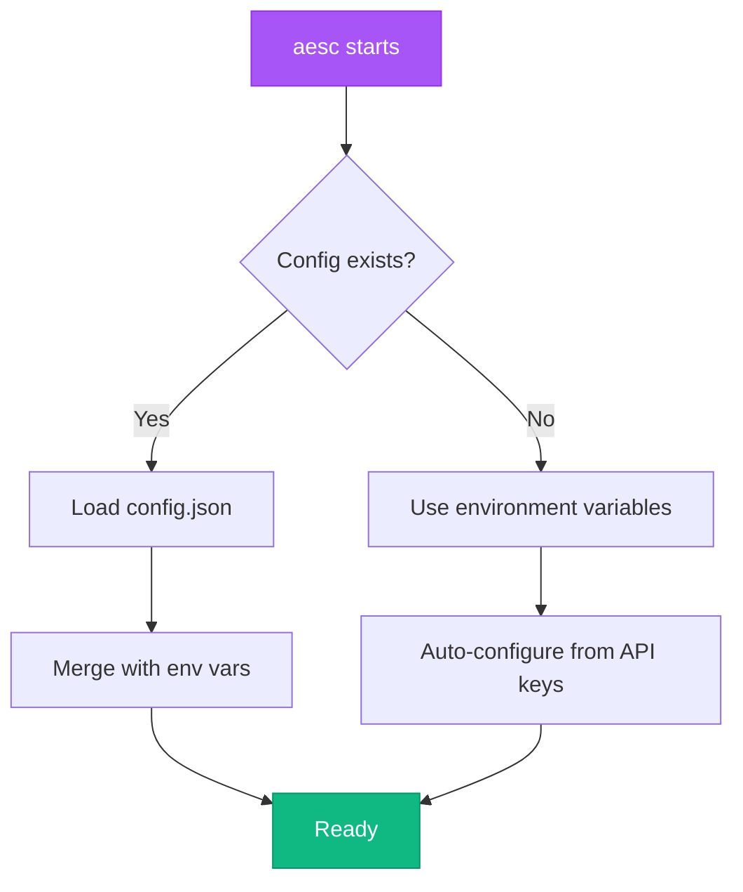

## Configuration Location

aesc stores its configuration in JSON format:

**Primary Location:** `~/.aesc/config.json`



<Info>
  aesc uses **JSON format** for configuration, not YAML. The configuration file is automatically created when you first run aesc.
</Info>

## Configuration Structure

### Complete Example

```json
{
  "default_model": "default",
  "providers": {
    "anthropic": {
      "type": "anthropic",
      "base_url": "https://api.anthropic.com",
      "api_key": "sk-ant-your-key-here"
    },
    "openai": {
      "type": "openai_responses",
      "base_url": "https://api.openai.com/v1",
      "api_key": "sk-your-key-here"
    },
    "ollama": {
      "type": "openai_legacy",
      "base_url": "http://localhost:11434/v1",
      "api_key": "ollama"
    }
  },
  "models": {
    "default": {
      "provider": "anthropic",
      "model": "claude-sonnet-4-20250514",
      "max_context_size": 200000
    },
    "gpt4": {
      "provider": "openai",
      "model": "gpt-4-turbo",
      "max_context_size": 128000
    },
    "local": {
      "provider": "ollama",
      "model": "llama3",
      "max_context_size": 8000
    }
  },
  "loop_control": {
    "max_steps_per_run": 100,
    "max_retries_per_step": 3
  },
  "services": {
    "moonshot_search": null
  }
}
```

## Configuration Schema

### Root Structure

```typescript
interface Config {
  default_model: string;           // Name of default model to use
  providers: Record<string, LLMProvider>;
  models: Record<string, LLMModel>;
  loop_control?: LoopControl;
  services?: Services;
}
```

### Provider Configuration

```typescript
interface LLMProvider {
  type: ProviderType;              // Provider type identifier
  base_url: string;                // API endpoint URL
  api_key: string;                 // API key (stored securely)
  custom_headers?: Record<string, string>;  // Optional custom headers
}

type ProviderType =
  | "anthropic"           // Anthropic Claude API
  | "openai_responses"    // OpenAI API (responses format)
  | "openai_legacy"       // OpenAI-compatible API (legacy format)
  | "kimi";               // Kimi/Moonshot API
```

### Model Configuration

```typescript
interface LLMModel {
  provider: string;                // Must match a key in providers
  model: string;                   // Provider-specific model ID
  max_context_size: number;        // Context window size in tokens
  capabilities?: ModelCapability[];  // Optional capability flags
}
```

### Loop Control

```typescript
interface LoopControl {
  max_steps_per_run?: number;      // Max agent steps (default: 100)
  max_retries_per_step?: number;   // Max retries per step (default: 3)
}
```

---

## Provider Configuration

### Anthropic Claude

<Tabs>
  <Tab title="Basic">
    ```json
    {
      "providers": {
        "anthropic": {
          "type": "anthropic",
          "base_url": "https://api.anthropic.com",
          "api_key": "sk-ant-your-key-here"
        }
      }
    }
    ```
  </Tab>

  <Tab title="Via Environment">
    No configuration needed if you set the environment variable:
    ```bash
    export ANTHROPIC_API_KEY=sk-ant-your-key-here
    aesc
    ```

    aesc will auto-configure Anthropic provider on startup.
  </Tab>

  <Tab title="With Custom Headers">
    ```json
    {
      "providers": {
        "anthropic": {
          "type": "anthropic",
          "base_url": "https://api.anthropic.com",
          "api_key": "sk-ant-your-key-here",
          "custom_headers": {
            "anthropic-beta": "max-tokens-3-5-sonnet-2024-07-15"
          }
        }
      }
    }
    ```
  </Tab>
</Tabs>

### OpenAI

<Tabs>
  <Tab title="OpenAI API">
    ```json
    {
      "providers": {
        "openai": {
          "type": "openai_responses",
          "base_url": "https://api.openai.com/v1",
          "api_key": "sk-your-key-here"
        }
      }
    }
    ```
  </Tab>

  <Tab title="Azure OpenAI">
    ```json
    {
      "providers": {
        "azure": {
          "type": "openai_responses",
          "base_url": "https://your-resource.openai.azure.com/",
          "api_key": "your-azure-key",
          "custom_headers": {
            "api-version": "2024-02-15-preview"
          }
        }
      }
    }
    ```
  </Tab>

  <Tab title="Via Environment">
    ```bash
    export OPENAI_API_KEY=sk-your-key-here
    aesc
    ```
  </Tab>
</Tabs>

### Ollama (Local)

<Tabs>
  <Tab title="Local Ollama">
    ```json
    {
      "providers": {
        "ollama": {
          "type": "openai_legacy",
          "base_url": "http://localhost:11434/v1",
          "api_key": "ollama"
        }
      }
    }
    ```

    <Info>
      The `api_key` value doesn't matter for local Ollama - use any non-empty string.
    </Info>
  </Tab>

  <Tab title="Docker Host">
    When running aesc in Docker and Ollama on host:
    ```json
    {
      "providers": {
        "ollama": {
          "type": "openai_legacy",
          "base_url": "http://host.docker.internal:11434/v1",
          "api_key": "ollama"
        }
      }
    }
    ```
  </Tab>

  <Tab title="Remote Ollama">
    ```json
    {
      "providers": {
        "ollama": {
          "type": "openai_legacy",
          "base_url": "http://ollama-server.example.com:11434/v1",
          "api_key": "ollama"
        }
      }
    }
    ```
  </Tab>

  <Tab title="Via Environment">
    ```bash
    export OLLAMA_BASE_URL=http://localhost:11434/v1
    aesc
    ```
  </Tab>
</Tabs>

### Kimi/Moonshot

```json
{
  "providers": {
    "kimi": {
      "type": "kimi",
      "base_url": "https://api.moonshot.cn/v1",
      "api_key": "your-kimi-key"
    }
  }
}
```

Or via environment:
```bash
export AESC_API_KEY=your-kimi-key
export AESC_BASE_URL=https://api.moonshot.cn/v1
aesc
```

---

## Model Configuration

### Model Definition

```json
{
  "models": {
    "model_name": {
      "provider": "provider_name",
      "model": "model_id",
      "max_context_size": 200000,
      "capabilities": ["extended_thinking"]
    }
  }
}
```

| Field | Type | Required | Description |
|-------|------|----------|-------------|
| `provider` | string | Yes | Must match a key in `providers` |
| `model` | string | Yes | Provider-specific model identifier |
| `max_context_size` | int | Yes | Maximum context window in tokens |
| `capabilities` | array | No | Model capabilities (e.g., `extended_thinking`) |

### Available Models

<Tabs>
  <Tab title="Anthropic Claude">
    ```json
    {
      "models": {
        "claude-sonnet": {
          "provider": "anthropic",
          "model": "claude-sonnet-4-20250514",
          "max_context_size": 200000
        },
        "claude-opus": {
          "provider": "anthropic",
          "model": "claude-3-opus-20240229",
          "max_context_size": 200000
        },
        "claude-haiku": {
          "provider": "anthropic",
          "model": "claude-3-haiku-20240307",
          "max_context_size": 200000
        }
      }
    }
    ```

    **Recommended Models:**
    - `claude-sonnet-4-20250514` - Best balance of speed and capability
    - `claude-3-opus-20240229` - Most capable, slower
    - `claude-3-haiku-20240307` - Fastest, less capable
  </Tab>

  <Tab title="OpenAI">
    ```json
    {
      "models": {
        "gpt4-turbo": {
          "provider": "openai",
          "model": "gpt-4-turbo",
          "max_context_size": 128000
        },
        "gpt4": {
          "provider": "openai",
          "model": "gpt-4",
          "max_context_size": 8192
        },
        "gpt35": {
          "provider": "openai",
          "model": "gpt-3.5-turbo",
          "max_context_size": 16384
        }
      }
    }
    ```
  </Tab>

  <Tab title="Ollama">
    ```json
    {
      "models": {
        "llama3": {
          "provider": "ollama",
          "model": "llama3",
          "max_context_size": 8000
        },
        "mistral": {
          "provider": "ollama",
          "model": "mistral",
          "max_context_size": 8000
        },
        "codellama": {
          "provider": "ollama",
          "model": "codellama",
          "max_context_size": 16000
        }
      }
    }
    ```

    <Info>
      Use `ollama list` to see installed models on your system.
    </Info>
  </Tab>
</Tabs>

---

## Loop Control

Control agent execution limits:

```json
{
  "loop_control": {
    "max_steps_per_run": 100,
    "max_retries_per_step": 3
  }
}
```

| Field | Default | Description |
|-------|---------|-------------|
| `max_steps_per_run` | 100 | Maximum tool calls per conversation turn |
| `max_retries_per_step` | 3 | Retries when a step fails |

<Info>
  Increase `max_steps_per_run` for complex multi-step tasks. The default of 100 is suitable for most use cases.
</Info>

---

## Services Configuration

Optional external service integrations:

```json
{
  "services": {
    "moonshot_search": {
      "base_url": "https://api.moonshot.cn/search",
      "api_key": "your-search-key",
      "custom_headers": {}
    }
  }
}
```

Set to `null` to disable:
```json
{
  "services": {
    "moonshot_search": null
  }
}
```

---

## Environment Variable Overrides

Environment variables take precedence over config file settings:

| Variable | Description |
|----------|-------------|
| `ANTHROPIC_API_KEY` | Auto-configure Anthropic provider |
| `OPENAI_API_KEY` | Auto-configure OpenAI provider |
| `OLLAMA_BASE_URL` | Auto-configure Ollama provider |
| `AESC_API_KEY` | Generic API key |
| `AESC_BASE_URL` | Generic API base URL |
| `AESC_MODEL_NAME` | Override default model |

**Priority Order:**
1. Command-line flags (highest)
2. Environment variables
3. Config file
4. Defaults (lowest)

---

## Configuration Templates

### Minimal Configuration

Just use environment variables:
```bash
export ANTHROPIC_API_KEY=sk-ant-your-key
aesc
```

Or minimal config file:
```json
{
  "default_model": "default",
  "providers": {
    "anthropic": {
      "type": "anthropic",
      "base_url": "https://api.anthropic.com",
      "api_key": "sk-ant-your-key"
    }
  },
  "models": {
    "default": {
      "provider": "anthropic",
      "model": "claude-sonnet-4-20250514",
      "max_context_size": 200000
    }
  }
}
```

### Development Configuration

Local Ollama for cost-free testing:
```json
{
  "default_model": "local",
  "providers": {
    "ollama": {
      "type": "openai_legacy",
      "base_url": "http://localhost:11434/v1",
      "api_key": "ollama"
    }
  },
  "models": {
    "local": {
      "provider": "ollama",
      "model": "llama3",
      "max_context_size": 8000
    }
  },
  "loop_control": {
    "max_steps_per_run": 50,
    "max_retries_per_step": 2
  }
}
```

### Production Configuration

Full configuration with multiple providers:
```json
{
  "default_model": "claude-sonnet",
  "providers": {
    "anthropic": {
      "type": "anthropic",
      "base_url": "https://api.anthropic.com",
      "api_key": "sk-ant-production-key"
    },
    "openai": {
      "type": "openai_responses",
      "base_url": "https://api.openai.com/v1",
      "api_key": "sk-openai-backup-key"
    }
  },
  "models": {
    "claude-sonnet": {
      "provider": "anthropic",
      "model": "claude-sonnet-4-20250514",
      "max_context_size": 200000
    },
    "claude-opus": {
      "provider": "anthropic",
      "model": "claude-3-opus-20240229",
      "max_context_size": 200000
    },
    "gpt4-fallback": {
      "provider": "openai",
      "model": "gpt-4-turbo",
      "max_context_size": 128000
    }
  },
  "loop_control": {
    "max_steps_per_run": 200,
    "max_retries_per_step": 5
  }
}
```

---

## Configuration Validation

aesc validates the configuration on startup. Common errors:

<AccordionGroup>
  <Accordion title="Invalid JSON syntax">
    **Error:** `JSONDecodeError`

    **Solution:**
    ```bash
    # Validate JSON syntax
    python -c "import json, os; json.load(open(os.path.expanduser('~/.aesc/config.json')))"
    ```
  </Accordion>

  <Accordion title="Provider not found">
    **Error:** `Provider 'xyz' not found in providers`

    **Solution:**
    Ensure the model's `provider` field matches a key in `providers`:
    ```json
    {
      "providers": {
        "anthropic": { ... }  // This key...
      },
      "models": {
        "default": {
          "provider": "anthropic"  // ...must match this
        }
      }
    }
    ```
  </Accordion>

  <Accordion title="Default model not found">
    **Error:** `Default model 'xyz' not found in models`

    **Solution:**
    Ensure `default_model` matches a key in `models`:
    ```json
    {
      "default_model": "default",  // This value...
      "models": {
        "default": { ... }  // ...must match this key
      }
    }
    ```
  </Accordion>

  <Accordion title="Missing required field">
    **Error:** `Field required`

    **Solution:**
    Check that all required fields are present:
    - Provider: `type`, `base_url`, `api_key`
    - Model: `provider`, `model`, `max_context_size`
  </Accordion>
</AccordionGroup>

---

## File Locations

| Path | Description |
|------|-------------|
| `~/.aesc/config.json` | Main configuration file |
| `~/.aesc/logs/aesc.log` | Application logs |
| `~/.aesc/sessions/` | Session history files |

<Info>
  aesc stores all state under `~/.aesc/` in the user's home directory.
</Info>

---

## Next Steps

<CardGroup cols={2}>
  <Card
    title="LLM Providers"
    icon="brain"
    href="/guides/llm-providers"
  >
    Detailed provider setup guides
  </Card>
  <Card
    title="Agents"
    icon="robot"
    href="/api-reference/agents"
  >
    Configure custom agents
  </Card>
  <Card
    title="CLI Commands"
    icon="terminal"
    href="/api-reference/cli-commands"
  >
    Command-line options
  </Card>
  <Card
    title="Troubleshooting"
    icon="wrench"
    href="/guides/troubleshooting"
  >
    Configuration issues
  </Card>
</CardGroup>
