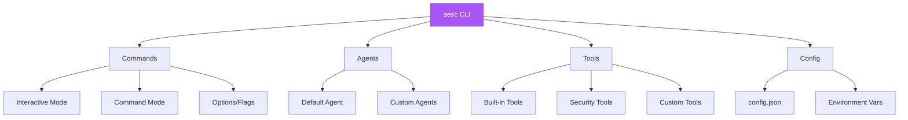
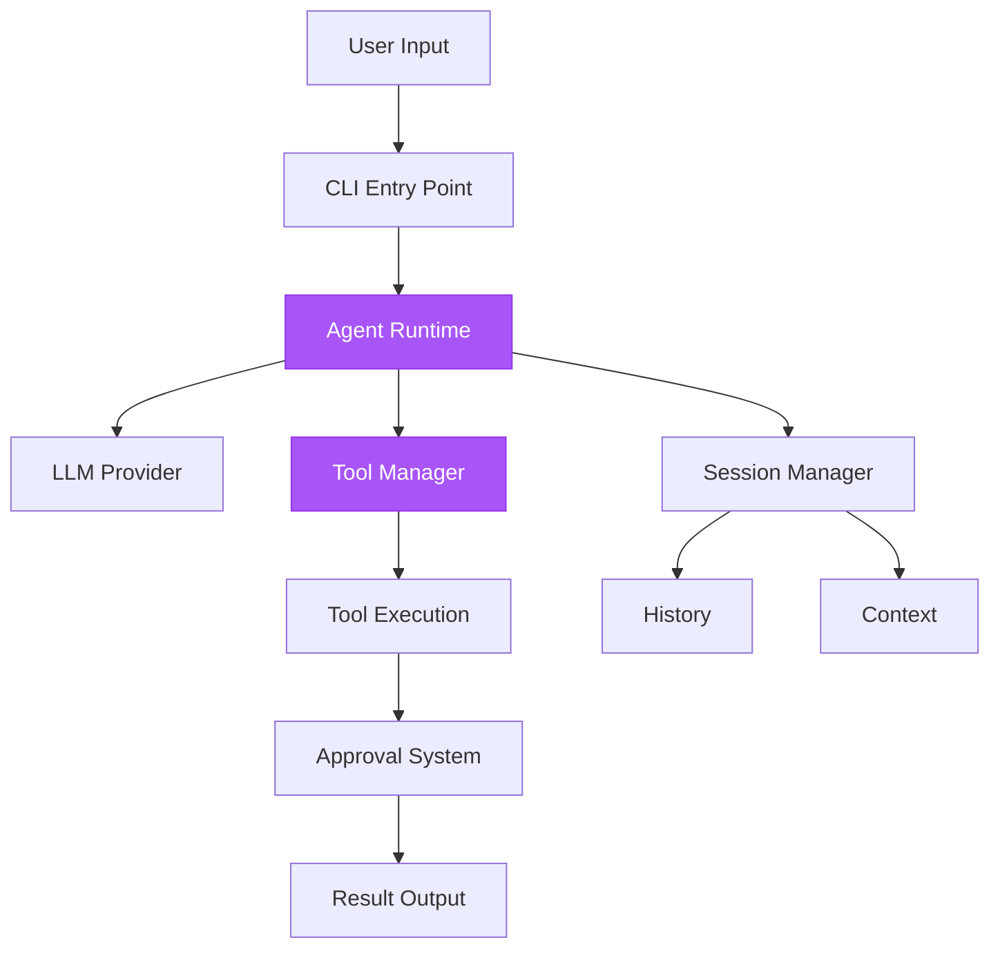
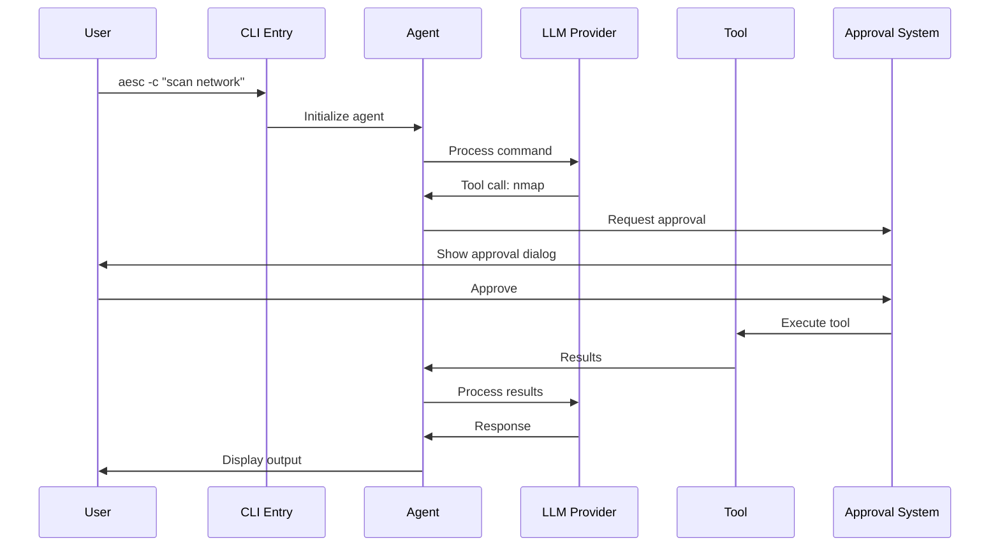

## Overview

aesc provides a comprehensive API for security operations, consisting of:
- CLI commands
- Agent specifications
- Tool integrations
- Configuration options



## Quick Reference

<CardGroup cols={2}>
  <Card
    title="CLI Commands"
    icon="terminal"
    href="/api-reference/cli-commands"
  >
    Complete command-line interface reference
  </Card>
  <Card
    title="Agents"
    icon="robot"
    href="/api-reference/agents"
  >
    Agent specifications and customization
  </Card>
  <Card
    title="Tools"
    icon="wrench"
    href="/api-reference/tools"
  >
    Built-in and security tool integrations
  </Card>
  <Card
    title="Configuration"
    icon="gear"
    href="/api-reference/configuration-file"
  >
    config.json reference and options
  </Card>
</CardGroup>

## Architecture

### Component Hierarchy



### Tool Execution Flow



## Core Components

### CLI Interface

The main entry point for aesc:

```bash
aesc [OPTIONS] [COMMAND]
```

**Modes:**
- **Interactive:** `aesc` - Start shell
- **Command:** `aesc -c "command"` - One-shot execution
- **Flags:** `aesc --help` - Show help

### Agent System

Agents orchestrate LLM interactions and tool executions:

**Default Agent:**
- General-purpose security agent
- Access to all tools
- Risk-based approvals

**Custom Agents:**
- Specialized for specific tasks
- Custom tool sets
- Tailored prompts

### Tool System

Tools provide functionality:

**Categories:**
1. **File Operations:** read, write, edit, grep, glob
2. **Network:** fetch, search
3. **Security:** bash (for nmap, sqlmap, etc.)
4. **Management:** SetTodoList, task tracking

### Configuration

Multiple configuration sources:

**Priority Order:**
1. Command-line flags
2. Environment variables
3. config.json
4. Defaults

## Usage Patterns

### Interactive Mode

```bash
aesc

# Inside aesc shell:
> scan 192.168.1.1
> /help
> /setup
> /clear
```

### Command Mode

```bash
# One-shot execution
aesc -c "scan 192.168.1.1"

# With flags
aesc --yolo -c "quick scan"
aesc --continue -c "continue previous"
```

### Programmatic Usage

```python
from aesc.cli import cli
from aesc.config import Config

# Load configuration
config = Config.load()

# Run command
cli(["scan", "192.168.1.1"], config=config)
```

## API Categories

<Tabs>
  <Tab title="CLI Commands">
    **Interactive Commands:**
    - `/help` - Show help
    - `/setup` - Configure LLM
    - `/clear` - Clear history
    - `/yolo` - Toggle auto-approve

    **Options:**
    - `--help` - Show help
    - `--version` - Show version
    - `--yolo` - Auto-approve
    - `--continue` - Resume session

    [Full CLI Reference →](/api-reference/cli-commands)
  </Tab>

  <Tab title="Agents">
    **Agent Specification:**
    ```yaml
    name: default
    description: Security agent
    tools:
      - read
      - write
      - bash
    prompt: |
      You are a security agent...
    ```

    [Full Agent Reference →](/api-reference/agents)
  </Tab>

  <Tab title="Tools">
    **Tool Interface:**
    ```python
    class MyTool(CallableTool2[Params]):
        name = "tool_name"
        description = "Tool description"
        params = ParamsModel

        async def __call__(self, params):
            # Implementation
            return result
    ```

    [Full Tool Reference →](/api-reference/tools)
  </Tab>

  <Tab title="Configuration">
    **config.json Structure:**
    ```json
    {
      "providers": {
        "anthropic": {
          "type": "anthropic",
          "api_key": "sk-ant-..."
        }
      },
      "models": {
        "default": {
          "provider": "anthropic",
          "model": "claude-sonnet-4-5-20250929"
        }
      },
      "default_model": "default"
    }
    ```

    [Full Config Reference →](/api-reference/configuration-file)
  </Tab>
</Tabs>

## Environment Variables

| Variable | Description | Default |
|----------|-------------|---------|
| `ANTHROPIC_API_KEY` | Claude API key | - |
| `OPENAI_API_KEY` | OpenAI API key | - |
| `OLLAMA_BASE_URL` | Ollama URL | `http://localhost:11434/v1` |
| `AESC_MODEL_NAME` | Model to use | - |
| `AESC_LOG_LEVEL` | Log level | `INFO` |
| `AESC_YOLO_MODE` | Auto-approve all | `0` |
| `UV_LINK_MODE` | UV package mode | `copy` |

## Response Formats

### Tool Call Format

```json
{
  "tool": "bash",
  "params": {
    "command": "nmap -sV 192.168.1.1"
  }
}
```

### Tool Result Format

```json
{
  "success": true,
  "output": "...",
  "error": null,
  "metadata": {
    "execution_time": 1.23,
    "tool": "bash"
  }
}
```

### Error Format

```json
{
  "success": false,
  "error": {
    "type": "ToolRejectedError",
    "message": "User rejected approval"
  }
}
```

## Extending aesc

### Custom Tools

Create custom tools by implementing the tool interface:

```python
from typing import ClassVar
from pydantic import BaseModel
from aesc.provider import CallableTool2, ToolReturnType
from aesc.tools.utils import ToolResultBuilder

class MyToolParams(BaseModel):
    target: str

class MyTool(CallableTool2[MyToolParams]):
    name: ClassVar[str] = "MyTool"
    description: ClassVar[str] = "Custom security tool"
    params: ClassVar[type[MyToolParams]] = MyToolParams

    async def __call__(self, params: MyToolParams) -> ToolReturnType:
        builder = ToolResultBuilder()
        # Your implementation
        builder.write("done")
        return builder.ok("Completed", brief="Success")
```

### Custom Agents

Define custom agent specifications. Tools are referenced by their
fully-qualified `"module.path:ClassName"` string:

```yaml
version: 1
agent:
  name: "recon-agent"
  system_prompt_path: ./system.md
  tools:
    - "aesc.tools.bash:Bash"
    - "aesc.tools.web:SearchWeb"
    - "aesc.tools.kali_docs:KaliDocs"
```

## Error Handling

### Common Errors

<AccordionGroup>
  <Accordion title="ConfigurationError">
    **Cause:** Invalid or missing configuration

    **Solution:** Check config.json syntax and API keys
  </Accordion>

  <Accordion title="ToolRejectedError">
    **Cause:** User rejected approval

    **Normal behavior:** User chose not to proceed
  </Accordion>

  <Accordion title="LLMError">
    **Cause:** LLM provider issue

    **Solution:** Check API key and connectivity
  </Accordion>

  <Accordion title="ToolExecutionError">
    **Cause:** Tool failed to execute

    **Solution:** Check tool availability and parameters
  </Accordion>
</AccordionGroup>

## Next Steps

<CardGroup cols={2}>
  <Card
    title="CLI Commands"
    icon="terminal"
    href="/api-reference/cli-commands"
  >
    Detailed command reference
  </Card>
  <Card
    title="Agents"
    icon="robot"
    href="/api-reference/agents"
  >
    Agent customization guide
  </Card>
  <Card
    title="Tools"
    icon="wrench"
    href="/api-reference/tools"
  >
    Tool development guide
  </Card>
  <Card
    title="Configuration"
    icon="gear"
    href="/api-reference/configuration-file"
  >
    Complete config reference
  </Card>
</CardGroup>
