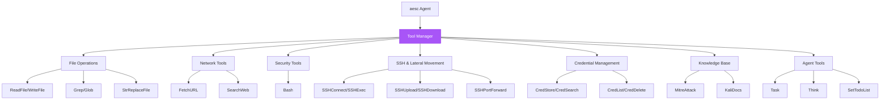
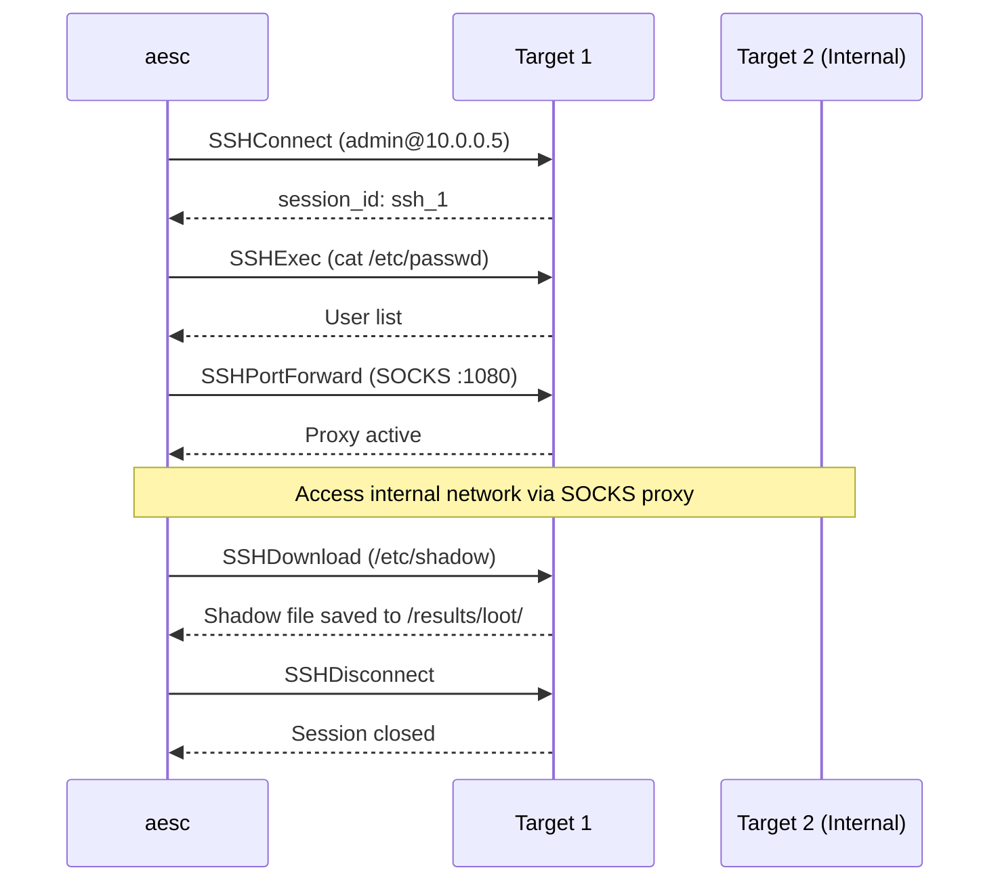
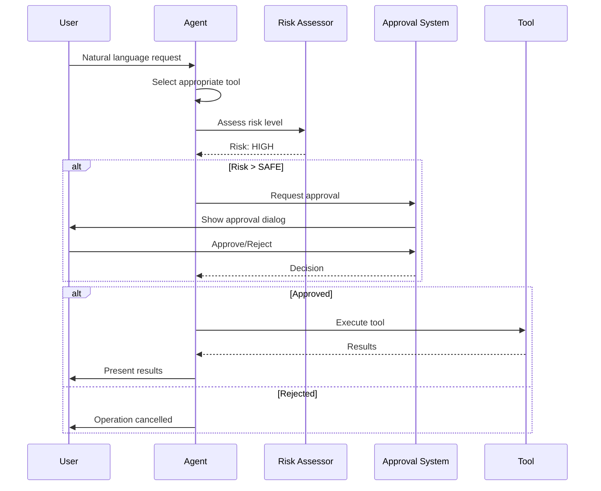

## Overview

Tools are the building blocks of aesc functionality. Each tool provides specific capabilities:



## Tool Name Reference

<Info>
  Tool names in aesc use PascalCase. When configuring agents, use the full module path format.
</Info>

| Display Name | Internal Name | Module Path |
|--------------|---------------|-------------|
| Read File | `ReadFile` | `aesc.tools.file:ReadFile` |
| Write File | `WriteFile` | `aesc.tools.file:WriteFile` |
| Edit File | `StrReplaceFile` | `aesc.tools.file:StrReplaceFile` |
| Grep | `Grep` | `aesc.tools.file:Grep` |
| Glob | `Glob` | `aesc.tools.file:Glob` |
| Fetch URL | `FetchURL` | `aesc.tools.web:FetchURL` |
| Search Web | `SearchWeb` | `aesc.tools.web:SearchWeb` |
| Bash | `Bash` | `aesc.tools.bash:Bash` |
| SSH Connect | `SSHConnect` | `aesc.tools.ssh:SSHConnect` |
| SSH Execute | `SSHExec` | `aesc.tools.ssh:SSHExec` |
| SSH Sessions | `SSHSessions` | `aesc.tools.ssh:SSHSessions` |
| SSH Disconnect | `SSHDisconnect` | `aesc.tools.ssh:SSHDisconnect` |
| SSH Upload | `SSHUpload` | `aesc.tools.ssh:SSHUpload` |
| SSH Download | `SSHDownload` | `aesc.tools.ssh:SSHDownload` |
| SSH Port Forward | `SSHPortForward` | `aesc.tools.ssh:SSHPortForward` |
| Credential Store | `CredStore` | `aesc.tools.creds:CredStore` |
| Credential Search | `CredSearch` | `aesc.tools.creds:CredSearch` |
| Credential List | `CredList` | `aesc.tools.creds:CredList` |
| Credential Delete | `CredDelete` | `aesc.tools.creds:CredDelete` |
| MITRE ATT&CK | `MitreAttack` | `aesc.tools.mitre_attack:MitreAttack` |
| Kali Docs | `KaliDocs` | `aesc.tools.kali_docs:KaliDocs` |
| Task | `Task` | `aesc.tools.task:Task` |
| Think | `Think` | `aesc.tools.think:Think` |
| Todo List | `SetTodoList` | `aesc.tools.todo:SetTodoList` |

---

## File Operations

<AccordionGroup>
  <Accordion title="ReadFile" icon="file">
    **Purpose:** Read file contents

    **Parameters:**
    | Parameter | Type | Required | Description |
    |-----------|------|----------|-------------|
    | `path` | string | Yes | Absolute or relative path to the file |

    **Example:**
    ```bash
    aesc> read the contents of /etc/hosts
    ```

    **Risk Level:** 🟢 SAFE
  </Accordion>

  <Accordion title="WriteFile" icon="file-pen">
    **Purpose:** Create or overwrite files

    **Parameters:**
    | Parameter | Type | Required | Description |
    |-----------|------|----------|-------------|
    | `path` | string | Yes | Destination file path |
    | `content` | string | Yes | Content to write |

    **Example:**
    ```bash
    aesc> write scan results to /tmp/report.txt
    ```

    **Risk Level:** 🟡 MEDIUM (🔴 CRITICAL if writing to system paths)
  </Accordion>

  <Accordion title="StrReplaceFile" icon="pen-to-square">
    **Purpose:** Replace text in existing files (string replacement)

    **Parameters:**
    | Parameter | Type | Required | Description |
    |-----------|------|----------|-------------|
    | `path` | string | Yes | File to edit |
    | `old_string` | string | Yes | Text to find and replace |
    | `new_string` | string | Yes | Replacement text |

    **Example:**
    ```bash
    aesc> change port 8080 to 9000 in config.yaml
    ```

    **Risk Level:** 🟡 MEDIUM
  </Accordion>

  <Accordion title="Grep" icon="magnifying-glass">
    **Purpose:** Search file contents using regex patterns

    **Parameters:**
    | Parameter | Type | Required | Description |
    |-----------|------|----------|-------------|
    | `pattern` | string | Yes | Regex pattern to search |
    | `path` | string | No | File or directory to search (default: cwd) |

    **Example:**
    ```bash
    aesc> search for "password" in /var/log
    ```

    **Risk Level:** 🟢 SAFE
  </Accordion>

  <Accordion title="Glob" icon="folder-tree">
    **Purpose:** Find files by glob pattern

    **Parameters:**
    | Parameter | Type | Required | Description |
    |-----------|------|----------|-------------|
    | `pattern` | string | Yes | Glob pattern (e.g., `*.txt`, `**/*.py`) |
    | `path` | string | No | Base directory (default: cwd) |

    **Example:**
    ```bash
    aesc> find all .conf files in /etc
    ```

    **Risk Level:** 🟢 SAFE
  </Accordion>
</AccordionGroup>

---

## Network Tools

<AccordionGroup>
  <Accordion title="FetchURL" icon="download">
    **Purpose:** Fetch content from a URL

    **Parameters:**
    | Parameter | Type | Required | Description |
    |-----------|------|----------|-------------|
    | `url` | string | Yes | URL to fetch |

    **Example:**
    ```bash
    aesc> fetch https://example.com/robots.txt
    ```

    **Risk Level:** 🟢 LOW
  </Accordion>

  <Accordion title="SearchWeb" icon="magnifying-glass">
    **Purpose:** Search the web for information

    **Parameters:**
    | Parameter | Type | Required | Description |
    |-----------|------|----------|-------------|
    | `query` | string | Yes | Search query |

    **Example:**
    ```bash
    aesc> search for CVE-2024-1234 exploit
    ```

    **Risk Level:** 🟢 LOW
  </Accordion>
</AccordionGroup>

---

## Security Tools

<AccordionGroup>
  <Accordion title="Bash" icon="terminal">
    **Purpose:** Execute shell commands with full access to Kali Linux tools

    **Parameters:**
    | Parameter | Type | Required | Description |
    |-----------|------|----------|-------------|
    | `command` | string | Yes | Shell command to execute |

    **Example:**
    ```bash
    aesc> run nmap -sV 192.168.1.1
    ```

    **Risk Level:** Variable (🟢 SAFE to 🔴 CRITICAL depending on command)

    <Warning>
      Direct shell access - risk is assessed based on command content.
      See [Risk-Based Approvals](/features/risk-based-approvals) for details.
    </Warning>

    **Available security tools (600+):**
    - `nmap` - Network scanning
    - `sqlmap` - SQL injection
    - `metasploit` - Exploitation framework
    - `gobuster` - Directory enumeration
    - `nikto` - Web scanning
    - `hydra` - Password cracking
    - And many more pre-installed in Kali Linux
  </Accordion>
</AccordionGroup>

---

## SSH & Lateral Movement Tools

<Info>
  SSH tools enable lateral movement during penetration testing engagements.
  All SSH operations require approval due to their HIGH risk level.
</Info>

<AccordionGroup>
  <Accordion title="SSHConnect" icon="plug">
    **Purpose:** Establish SSH connection to a remote host

    **Parameters:**
    | Parameter | Type | Required | Default | Description |
    |-----------|------|----------|---------|-------------|
    | `host` | string | Yes | - | Target hostname or IP |
    | `port` | int | No | 22 | SSH port |
    | `username` | string | Yes | - | Username for auth |
    | `password` | string | No | - | Password (if using password auth) |
    | `key_path` | string | No | - | Path to SSH private key |
    | `key_passphrase` | string | No | - | Passphrase for encrypted key |
    | `timeout` | int | No | 10 | Connection timeout (seconds) |

    **Example:**
    ```bash
    aesc> connect to 10.0.0.5 as admin using /loot/id_rsa
    ```

    **Returns:** Session ID (e.g., `ssh_1`) for use with other SSH tools

    **Risk Level:** 🟠 HIGH
  </Accordion>

  <Accordion title="SSHExec" icon="terminal">
    **Purpose:** Execute command on remote host via SSH

    **Parameters:**
    | Parameter | Type | Required | Default | Description |
    |-----------|------|----------|---------|-------------|
    | `session_id` | string | Yes | - | Session ID from SSHConnect |
    | `command` | string | Yes | - | Command to execute |
    | `timeout` | int | No | 60 | Command timeout (seconds) |

    **Example:**
    ```bash
    aesc> on ssh_1 run "cat /etc/passwd"
    ```

    **Risk Level:** 🟠 HIGH
  </Accordion>

  <Accordion title="SSHSessions" icon="list">
    **Purpose:** List all active SSH sessions

    **Parameters:** None

    **Example:**
    ```bash
    aesc> show active SSH sessions
    ```

    **Output:**
    ```
    Active SSH Sessions:
    ────────────────────────────────────────
      ssh_1: admin@10.0.0.5:22 [✓ connected]
      ssh_2: root@10.0.0.10:22 [✓ connected]
        └─ dynamic: SOCKS localhost:1080
    ```

    **Risk Level:** 🟢 SAFE
  </Accordion>

  <Accordion title="SSHDisconnect" icon="plug-circle-xmark">
    **Purpose:** Close an SSH session

    **Parameters:**
    | Parameter | Type | Required | Description |
    |-----------|------|----------|-------------|
    | `session_id` | string | Yes | Session ID to disconnect |

    **Example:**
    ```bash
    aesc> disconnect ssh_1
    ```

    **Risk Level:** 🟢 SAFE
  </Accordion>

  <Accordion title="SSHUpload" icon="upload">
    **Purpose:** Upload file to remote host via SCP/SFTP

    **Parameters:**
    | Parameter | Type | Required | Description |
    |-----------|------|----------|-------------|
    | `session_id` | string | Yes | Session ID from SSHConnect |
    | `local_path` | string | Yes | Local file to upload |
    | `remote_path` | string | Yes | Remote destination path |

    **Example:**
    ```bash
    aesc> upload /tools/linpeas.sh to /tmp on ssh_1
    ```

    **Risk Level:** 🟠 HIGH
  </Accordion>

  <Accordion title="SSHDownload" icon="download">
    **Purpose:** Download file from remote host via SCP/SFTP

    **Parameters:**
    | Parameter | Type | Required | Description |
    |-----------|------|----------|-------------|
    | `session_id` | string | Yes | Session ID from SSHConnect |
    | `remote_path` | string | Yes | Remote file to download |
    | `local_path` | string | Yes | Local destination (file or directory) |

    **Example:**
    ```bash
    aesc> download /etc/shadow from ssh_1 to /results/loot/
    ```

    **Risk Level:** 🟠 HIGH
  </Accordion>

  <Accordion title="SSHPortForward" icon="shuffle">
    **Purpose:** Set up SSH port forwarding for pivoting

    **Parameters:**
    | Parameter | Type | Required | Description |
    |-----------|------|----------|-------------|
    | `session_id` | string | Yes | Session ID from SSHConnect |
    | `forward_type` | string | Yes | `local` (-L), `remote` (-R), or `dynamic` (-D) |
    | `local_port` | int | Yes | Local port to bind |
    | `remote_host` | string | No | Remote host (for local/remote forwards) |
    | `remote_port` | int | No | Remote port (for local/remote forwards) |

    **Examples:**

    ```bash
    # SOCKS proxy for pivoting
    aesc> create SOCKS proxy on port 1080 via ssh_1

    # Local port forward to internal service
    aesc> forward local port 8080 to 10.0.0.100:80 via ssh_1

    # Remote port forward (reverse tunnel)
    aesc> forward remote port 4444 to localhost:4444 via ssh_1
    ```

    **Risk Level:** 🟠 HIGH
  </Accordion>
</AccordionGroup>

### SSH Workflow Example



---

## Credential Management Tools

<Info>
  Credential tools help track discovered credentials during an engagement.
  Credentials are stored in memory and optionally saved to `/results/creds.json` (with secrets redacted).
</Info>

<AccordionGroup>
  <Accordion title="CredStore" icon="key">
    **Purpose:** Store a discovered credential

    **Parameters:**
    | Parameter | Type | Required | Description |
    |-----------|------|----------|-------------|
    | `cred_type` | string | Yes | Type: `password`, `ssh_key`, `hash`, `token`, `api_key` |
    | `username` | string | Yes | Username or account name |
    | `secret` | string | Yes | Password, key, hash, or token |
    | `host` | string | No | Associated host/IP |
    | `port` | int | No | Associated port |
    | `source` | string | No | Where found (e.g., `/etc/shadow`) |
    | `notes` | string | No | Additional notes |

    **Example:**
    ```bash
    aesc> store credential: admin:P@ssw0rd from 10.0.0.5 /etc/shadow
    ```

    **Risk Level:** 🟢 SAFE (storing only)
  </Accordion>

  <Accordion title="CredSearch" icon="magnifying-glass">
    **Purpose:** Search stored credentials

    **Parameters:**
    | Parameter | Type | Required | Description |
    |-----------|------|----------|-------------|
    | `host` | string | No | Filter by host |
    | `username` | string | No | Filter by username |
    | `cred_type` | string | No | Filter by type |

    **Example:**
    ```bash
    aesc> find credentials for host 10.0.0.5
    aesc> find all SSH keys
    ```

    **Risk Level:** 🟢 SAFE
  </Accordion>

  <Accordion title="CredList" icon="list">
    **Purpose:** List all stored credentials

    **Parameters:** None

    **Example:**
    ```bash
    aesc> show all credentials
    ```

    **Output:**
    ```
    Stored Credentials (3):
    ──────────────────────────────────────────────────

    [10.0.0.5]
      [1] password: admin:P@s*** @ 10.0.0.5
      [2] ssh_key: root:---*** @ 10.0.0.5

    [10.0.0.10]
      [3] hash: svc_account:5f4*** @ 10.0.0.10

    Saved to: /results/creds.json (secrets redacted)
    ```

    **Risk Level:** 🟢 SAFE
  </Accordion>

  <Accordion title="CredDelete" icon="trash">
    **Purpose:** Delete a stored credential

    **Parameters:**
    | Parameter | Type | Required | Description |
    |-----------|------|----------|-------------|
    | `cred_id` | int | Yes | Credential ID to delete |

    **Example:**
    ```bash
    aesc> delete credential #2
    ```

    **Risk Level:** 🟢 SAFE
  </Accordion>
</AccordionGroup>

---

## Knowledge Base Tools

<AccordionGroup>
  <Accordion title="MitreAttack" icon="shield-halved">
    **Purpose:** Query the MITRE ATT&CK framework for tactics, techniques, groups, and software

    **Parameters:**
    | Parameter | Type | Required | Default | Description |
    |-----------|------|----------|---------|-------------|
    | `query` | string | Yes | - | Search query (technique ID, name, tactic, group, or keyword) |
    | `type` | string | No | `auto` | Query type: `auto`, `technique`, `tactic`, `group`, `software`, `keyword` |

    **Examples:**
    ```bash
    # Look up a technique
    aesc> lookup MITRE technique T1003

    # Find techniques by tactic
    aesc> show MITRE techniques for "credential access"

    # Look up a threat group
    aesc> what techniques does APT29 use?

    # Keyword search
    aesc> search MITRE for "lateral movement"
    ```

    **Output:**
    ```
    T1003 - OS Credential Dumping

    Tactics: Credential Access

    Description:
    Adversaries may attempt to dump credentials to obtain account
    login and credential material...

    Sub-techniques:
    • T1003.001 - LSASS Memory
    • T1003.002 - Security Account Manager
    • T1003.003 - NTDS
    ...

    Mitigations:
    • M1025 - Privileged Process Integrity
    • M1026 - Privileged Account Management
    ...

    Detection:
    • Monitor for unexpected processes accessing LSASS
    ...
    ```

    **Risk Level:** 🟢 SAFE
  </Accordion>

  <Accordion title="KaliDocs" icon="book">
    **Purpose:** Search Kali Linux tool documentation (290+ tools)

    **Parameters:**
    | Parameter | Type | Required | Description |
    |-----------|------|----------|-------------|
    | `query` | string | Yes | Tool name or search query |

    **Examples:**
    ```bash
    aesc> how do I use nmap?
    aesc> show sqlmap documentation
    aesc> what tool finds subdomains?
    ```

    **Risk Level:** 🟢 SAFE
  </Accordion>
</AccordionGroup>

---

## Agent Tools

<AccordionGroup>
  <Accordion title="Task" icon="list-check">
    **Purpose:** Delegate complex tasks to specialized sub-agents

    **Parameters:**
    | Parameter | Type | Required | Description |
    |-----------|------|----------|-------------|
    | `description` | string | Yes | Short task description |
    | `prompt` | string | Yes | Detailed task instructions |

    **Example:**
    ```bash
    aesc> delegate code review to sub-agent
    ```

    **Risk Level:** 🟢 SAFE
  </Accordion>

  <Accordion title="Think" icon="brain">
    **Purpose:** Extended reasoning and planning tool

    **Parameters:**
    | Parameter | Type | Required | Description |
    |-----------|------|----------|-------------|
    | `thought` | string | Yes | Reasoning or planning content |

    **Example:**
    Used internally by the agent for complex reasoning.

    **Risk Level:** 🟢 SAFE
  </Accordion>

  <Accordion title="SetTodoList" icon="clipboard-list">
    **Purpose:** Manage task lists for tracking progress

    **Parameters:**
    | Parameter | Type | Required | Description |
    |-----------|------|----------|-------------|
    | `todos` | array | Yes | Array of todo items |

    **Example:**
    ```bash
    aesc> create a todo list for this penetration test
    ```

    **Risk Level:** 🟢 SAFE
  </Accordion>
</AccordionGroup>

---

## Tool Execution Flow



---

## Risk Levels Summary

| Level | Icon | Description | Examples |
|-------|------|-------------|----------|
| **SAFE** | 🟢 | Read-only, no side effects | ReadFile, Grep, Glob, MitreAttack |
| **LOW** | 🟢 | Minor side effects | FetchURL, SearchWeb |
| **MEDIUM** | 🟡 | Moderate impact | WriteFile, StrReplaceFile |
| **HIGH** | 🟠 | Significant impact, network ops | SSH tools, Bash (recon commands) |
| **CRITICAL** | 🔴 | Destructive, exploitation | Bash (rm -rf, exploit commands) |

---

## Tool Development

### Creating Custom Tools

```python
from typing import Any, ClassVar
from pydantic import BaseModel, Field
from aesc.provider import CallableTool2, ToolReturnType
from aesc.soul.approval import Approval
from aesc.tools.utils import ToolResultBuilder

class MyToolParams(BaseModel):
    """Parameters for MyTool."""
    target: str = Field(description="Target to check")
    option: str = Field(default="default", description="Optional setting")

class MyTool(CallableTool2[MyToolParams]):
    """Custom security tool description."""

    name: ClassVar[str] = "MyTool"
    description: ClassVar[str] = "What this tool does"
    params: ClassVar[type[MyToolParams]] = MyToolParams

    def __init__(self, approval: Approval, **kwargs: Any):
        super().__init__(**kwargs)
        self._approval = approval

    async def __call__(self, params: MyToolParams) -> ToolReturnType:
        # Request approval for risky operations
        if not await self._approval.request(
            self.name,
            "run security check",
            f"Check {params.target}"
        ):
            from aesc.tools.utils import ToolRejectedError
            return ToolRejectedError()

        builder = ToolResultBuilder()

        # Your implementation
        result = do_security_check(params.target, params.option)

        builder.write(result)
        return builder.ok("Check completed", brief="Success")
```

### Registering Tools in Agent

```yaml
# agent.yaml
version: 1
agent:
  name: my-agent
  system_prompt_path: ./system.md
  tools:
    - "aesc.tools.bash:Bash"
    - "aesc.tools.file:ReadFile"
    - "my_package.my_module:MyTool"  # Your custom tool
```

---

## Best Practices

<CardGroup cols={2}>
  <Card title="Use Approval System" icon="shield-check">
    Always request approval for risky operations
  </Card>
  <Card title="Validate Inputs" icon="check">
    Use Pydantic models for parameter validation
  </Card>
  <Card title="Handle Errors" icon="triangle-exclamation">
    Return structured error responses using ToolResultBuilder
  </Card>
  <Card title="Document Behavior" icon="book">
    Clear descriptions help the LLM use tools correctly
  </Card>
  <Card title="Keep Tools Focused" icon="bullseye">
    One tool, one responsibility
  </Card>
  <Card title="Return Structured Data" icon="table">
    Use ToolResultBuilder for consistent responses
  </Card>
</CardGroup>

---

## Next Steps

<CardGroup cols={2}>
  <Card
    title="Agents"
    icon="robot"
    href="/api-reference/agents"
  >
    Configure which tools agents can use
  </Card>
  <Card
    title="Risk-Based Approvals"
    icon="shield-check"
    href="/features/risk-based-approvals"
  >
    Understand tool risk assessment
  </Card>
  <Card
    title="Development"
    icon="code"
    href="/advanced/development"
  >
    Build custom tools
  </Card>
  <Card
    title="CLI Commands"
    icon="terminal"
    href="/api-reference/cli-commands"
  >
    Command-line reference
  </Card>
</CardGroup>
