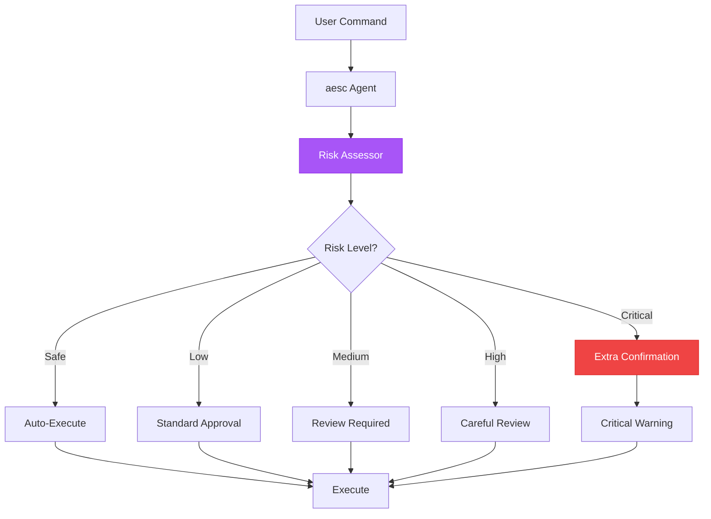
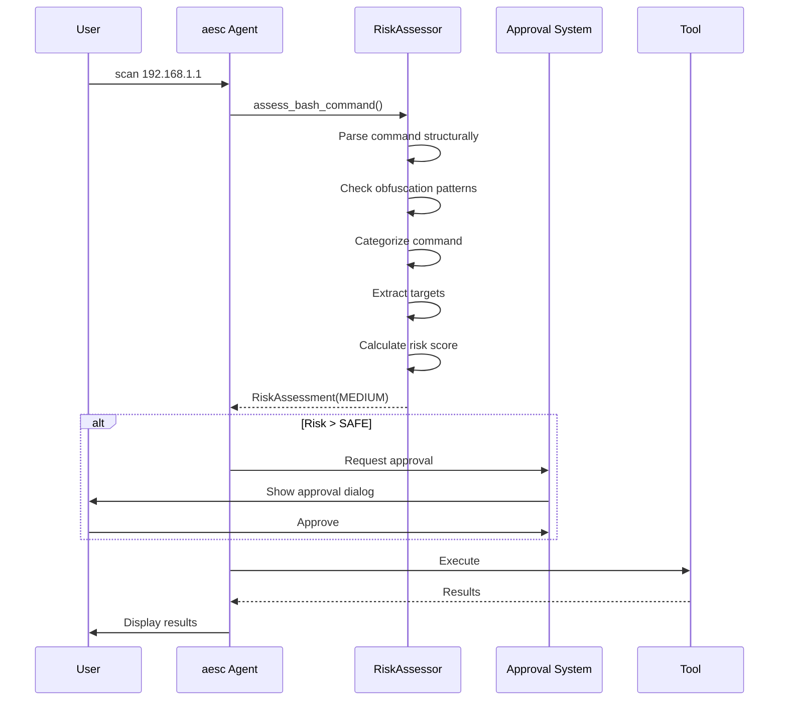

<Info>
  **Status:** Implemented in v0.1.0+

  Critical feature for safe security operations
</Info>

## Overview

The Risk-Based Approval System provides intelligent security assessment for all tool executions in aesc. This feature helps security operators understand the potential impact of operations before approval, preventing accidental damage during penetration testing.



## Risk Levels

aesc uses five risk levels for comprehensive operation classification:

| Level | Icon | Color | Description |
|-------|------|-------|-------------|
| **SAFE** | | green | Read-only, no side effects |
| **LOW** | | cyan | Minor side effects, easily reversible |
| **MEDIUM** | | yellow | Moderate impact, some irreversibility |
| **HIGH** | | dark_orange | Significant impact, network operations |
| **CRITICAL** | | red | Destructive, irreversible, dangerous |

---

### SAFE Risk

**Read-only operations** with no side effects - auto-approved in normal mode.

**Tools:**
- `ReadFile` - Read files
- `Grep` - Search content
- `Glob` - Find files
- `MitreAttack` - MITRE ATT&CK lookups
- `KaliDocs` - Documentation search
- `SSHSessions` - List SSH sessions
- `CredList` - List credentials
- `SetTodoList` - Task management
- `Think` - Agent reasoning

**Example:**
```
Tool: ReadFile | Risk: SAFE

Read file /etc/hosts

Risk Factors:
  - Category: readonly

[Auto-approved]
```

---

### LOW Risk

**Minor impact operations** - network fetches, web searches.

**Tools:**
- `FetchURL` - Download URL content
- `SearchWeb` - Web search
- Bash commands like `ls`, `pwd`, `cat`, `ping`

**Example:**
```
Tool: Bash | Risk: LOW

Run command: ping -c 4 192.168.1.1

Risk Factors:
  - Category: recon

[Approve] [Reject]
```

---

### MEDIUM Risk

**Network scanning** and file modifications.

**Tools:**
- `WriteFile` - Create/overwrite files
- `StrReplaceFile` - Edit files
- Enumeration tools: `gobuster`, `nikto`, `enum4linux`
- Recon tools: `nmap`, `masscan`

**Example:**
```
Tool: Bash | Risk: MEDIUM

Run command: nmap -sV 192.168.1.1

Risk Factors:
  - Category: recon
  - Extracted targets: 192.168.1.1

[Approve] [Approve for session] [Reject]
```

---

### HIGH Risk

**Active exploitation** and lateral movement operations.

**Tools:**
- `SSHConnect` - Establish SSH connections
- `SSHExec` - Execute remote commands
- `SSHUpload` / `SSHDownload` - File transfers
- `SSHPortForward` - Port forwarding
- `CredStore` - Store credentials
- Exploitation tools: `hydra`, `sqlmap`, `crackmapexec`

**Example:**
```
Tool: SSHConnect | Risk: HIGH

Connect to 10.0.0.5 as admin

Risk Factors:
  - SSH operation (lateral movement)

Mitigation Suggestions:
  - Verify target is in scope
  - Ensure proper authorization

[Approve] [Approve for session] [Reject]
```

---

### CRITICAL Risk

**Destructive operations** and active exploitation.

**Triggers:**
- Metasploit/exploitation frameworks
- `rm -rf /` or similar destructive commands
- Writing to system directories (`/etc/`, `/bin/`, etc.)
- Fork bombs and resource exhaustion
- Disk formatting commands

**Example:**
```
Tool: Bash | Risk: CRITICAL

Run command: rm -rf /home/*

Risk Factors:
  - Self-destructive: rm on home/root

CRITICAL OPERATION - REVIEW CAREFULLY
This operation can cause significant damage.

[Approve] [Reject]
```

---

## Command Risk Assessment

The Risk Assessor uses sophisticated pattern matching to evaluate commands:

### Command Categories

```python
# Read-only commands - SAFE
READONLY_COMMANDS = {
    "ls", "pwd", "whoami", "date", "uptime", "uname",
    "cat", "head", "tail", "less", "more",
    "grep", "find", "locate", "which", "whereis",
}

# Recon commands - LOW to MEDIUM
RECON_COMMANDS = {
    "nmap", "masscan", "rustscan",
    "dig", "nslookup", "host", "whois", "dnsrecon",
    "ping", "traceroute", "mtr",
}

# Enumeration commands - MEDIUM
ENUMERATION_COMMANDS = {
    "gobuster", "dirb", "dirbuster", "feroxbuster", "ffuf",
    "nikto", "wpscan", "droopescan",
    "enum4linux", "smbclient", "rpcclient",
}

# Exploitation commands - HIGH
EXPLOITATION_COMMANDS = {
    "msfconsole", "msfvenom", "metasploit",
    "hydra", "medusa", "ncrack",
    "hashcat", "john",
    "sqlmap", "crackmapexec",
}
```

### Obfuscation Detection

The system detects attempts to bypass risk assessment:

| Pattern | Detection | Risk Increase |
|---------|-----------|---------------|
| `base64 -d` | Base64 decoding | +2 |
| `\x[hex]` | Hex escape sequences | +2 |
| `${var}cmd` | Variable injection | +2 |
| `eval`, `exec` | Dynamic execution | +2 |
| `/./` or `//` | Path obfuscation | +2 |
| `$( printf` | Printf command construction | +2 |

**Example:**
```
Tool: Bash | Risk: HIGH

Run command: echo "cm0gLXJmIC8=" | base64 -d | bash

Risk Factors:
  - Obfuscation: base64_decode
  - Obfuscation: base64_pipe
  - Pipe to shell from network

[Approve] [Reject]
```

### Self-Destructive Pattern Detection

Commands that could damage the operator's machine are flagged as CRITICAL:

```python
SELF_DESTRUCTIVE_COMMANDS = {
    "patterns": [
        (r"\brm\s+(-[rf]+\s+)*(/|~|\$HOME)", "rm on home/root"),
        (r"\brm\s+.*--no-preserve-root", "rm no-preserve-root"),
        (r"\bdd\s+.*of=/dev/[sh]d[a-z]", "dd to disk"),
        (r"\bmkfs\.", "filesystem format"),
        (r":\s*\(\s*\)\s*\{.*:\s*\|.*&\s*\}", "fork bomb"),
        (r"\bchmod\s+(-R\s+)?777\s+/", "chmod 777 root"),
    ],
}
```

### Target Extraction

The system extracts targets for scope validation:

```python
# Extracted from commands
extracted_targets = {
    "ips": ["192.168.1.1", "10.0.0.0/24"],
    "domains": ["example.com"],
    "ports": [22, 80, 443],
}
```

---

## Usage Flow



---

## Configuration

### YOLO Mode (Not Recommended)

Bypass all approvals for automated workflows:

<Tabs>
  <Tab title="CLI Flag">
    ```bash
    aesc --yolo -c "scan network"
    # Aliases: --yes, -y, --auto-approve
    ```
  </Tab>

  <Tab title="Environment Variable">
    ```bash
    export AESC_YOLO_MODE=1
    aesc -c "scan network"
    ```
  </Tab>

  <Tab title="Print Mode">
    ```bash
    # Print mode implicitly enables yolo
    aesc --print -c "scan network"
    ```
  </Tab>
</Tabs>

<Warning>
  **YOLO mode disables all safety checks!**

  Only use in:
  - Controlled lab environments
  - Automated testing pipelines
  - Trusted, isolated networks

  Never use on production or unauthorized targets!
</Warning>

### Session Approvals

Approve a risk level for the entire session:

```
Tool: Bash | Risk: MEDIUM

Run command: nmap -sV 192.168.1.1

[Approve] [Approve MEDIUM for session] [Reject]
          ↑
          Approves all MEDIUM and below risks
```

**Behavior:**
- Approving MEDIUM also auto-approves LOW and SAFE
- Session approvals reset when aesc restarts
- Critical operations always require explicit approval

---

## API Reference

### RiskAssessor Class

```python
from aesc.security.risk import RiskAssessor, RiskLevel, RiskAssessment

# Create assessor
assessor = RiskAssessor()

# Assess a bash command
assessment = assessor.assess_bash_command("nmap -sV 192.168.1.1")

print(f"Level: {assessment.level}")           # RiskLevel.MEDIUM
print(f"Reason: {assessment.reason}")         # "Category: recon"
print(f"Patterns: {assessment.patterns_matched}")
print(f"Targets: {assessment.extracted_targets}")

# Assess a tool call
assessment = assessor.assess_tool_call("SSHConnect", '{"host": "10.0.0.5"}')
print(f"Level: {assessment.level}")           # RiskLevel.HIGH
```

### RiskLevel Enum

```python
from aesc.security.risk import RiskLevel

class RiskLevel(Enum):
    SAFE = ("safe", "green", "")       # Read-only, no side effects
    LOW = ("low", "cyan", "")           # Minor side effects
    MEDIUM = ("medium", "yellow", "")   # Moderate impact
    HIGH = ("high", "dark_orange", "")  # Significant impact
    CRITICAL = ("critical", "red", "")  # Destructive operations

    # Comparison operators
    RiskLevel.LOW < RiskLevel.MEDIUM  # True
    RiskLevel.HIGH >= RiskLevel.MEDIUM  # True
```

### RiskAssessment NamedTuple

```python
from typing import NamedTuple

class RiskAssessment(NamedTuple):
    level: RiskLevel                    # Assessed risk level
    reason: str                         # Why this risk level
    patterns_matched: list[str]         # Patterns that triggered assessment
    obfuscation_detected: list[str]     # Obfuscation tricks found
    extracted_targets: ExtractedTargets | None  # IPs, domains, ports

class ExtractedTargets:
    ips: list[str]       # ["192.168.1.1", "10.0.0.0/24"]
    domains: list[str]   # ["example.com"]
    ports: list[int]     # [22, 80, 443]
```

---

## Best Practices

<CardGroup cols={2}>
  <Card title="Review Risk Factors" icon="eye">
    Always read why a command is flagged as risky
  </Card>
  <Card title="Understand Categories" icon="book">
    Learn command categories and their risk levels
  </Card>
  <Card title="Use Session Approvals Wisely" icon="clock">
    Only for repeated trusted operations at same risk level
  </Card>
  <Card title="Document Critical Ops" icon="file-pen">
    Note why you approved critical operations
  </Card>
  <Card title="Have Rollback Plans" icon="rotate-left">
    Know how to undo before approving critical ops
  </Card>
  <Card title="Verify Authorization" icon="shield-check">
    Always confirm proper authorization for targets
  </Card>
</CardGroup>

---

## Troubleshooting

<AccordionGroup>
  <Accordion title="False positive - legitimate command flagged">
    **Problem:** Safe command flagged as high risk

    **Solutions:**
    1. Review detected patterns - may contain risky-looking strings
    2. Check for unintended obfuscation patterns
    3. Use session approval for repeated operations
    4. Verify command syntax is standard

    **Example:** `echo "rm -rf" | cat` - contains rm -rf string but doesn't execute it
  </Accordion>

  <Accordion title="Too many approval prompts">
    **Problem:** Constant prompts slow workflow

    **Solutions:**
    1. Use "Approve for session" for trusted risk levels
    2. Use `--yolo` for isolated lab environments
    3. Batch similar operations together
    4. Consider print mode for automation
  </Accordion>

  <Accordion title="Command not categorized correctly">
    **Problem:** Unknown tool gets wrong risk level

    **Solution:**
    Unknown commands default to LOW risk. The risk increases based on:
    - Piping to shell
    - Subshell execution
    - Chained commands
    - Backgrounded execution
  </Accordion>
</AccordionGroup>

---

## Related Features

<CardGroup cols={2}>
  <Card
    title="Tools Reference"
    icon="wrench"
    href="/api-reference/tools"
  >
    Tool risk levels documentation
  </Card>
  <Card
    title="CLI Commands"
    icon="terminal"
    href="/api-reference/cli-commands"
  >
    --yolo and approval options
  </Card>
  <Card
    title="Security Best Practices"
    icon="shield"
    href="/guides/security-best-practices"
  >
    Safe usage guidelines
  </Card>
  <Card
    title="Agents"
    icon="robot"
    href="/api-reference/agents"
  >
    Tool access control per agent
  </Card>
</CardGroup>
