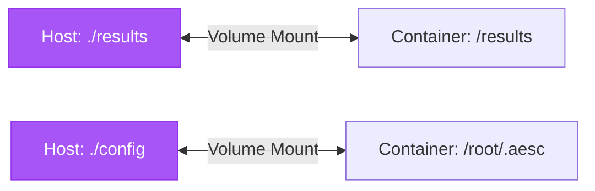
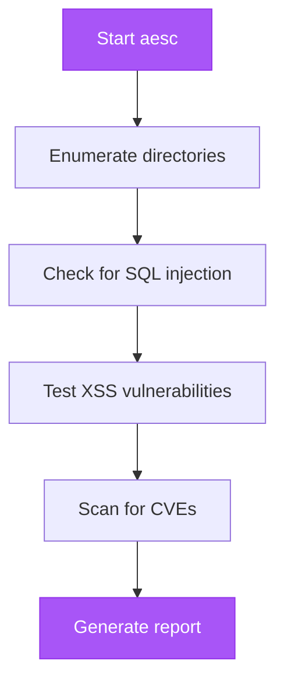

## Architecture Overview

```mermaid
graph TB
    A[Host Machine] -->|Docker Run| B[aesc Container]
    B -->|Includes| C[Kali Linux]
    B -->|Includes| D[Python 3.13]
    B -->|Includes| E[aesc CLI]
    B -->|Includes| F[Security Tools]
    F --> G[nmap]
    F --> H[sqlmap]
    F --> I[metasploit]
    F --> J[+ more via apt]

    B -->|Volume Mount| K[/results]
    B -->|Volume Mount| L[/config]

    B -->|API Calls| M[LLM Provider]
    M --> N[Claude]
    M --> O[OpenAI]
    M --> P[Ollama]

    style B fill:#A855F7,stroke:#9333EA,color:#fff
    style M fill:#A855F7,stroke:#9333EA,color:#fff
```

## Prerequisites

<CardGroup cols={2}>
  <Card title="Docker" icon="docker">
    Docker installed ([Get Docker](https://docs.docker.com/get-docker/))
  </Card>
  <Card title="Docker Compose" icon="layer-group">
    Usually included with Docker Desktop
  </Card>
  <Card title="LLM Provider" icon="brain">
    Claude, OpenAI, or Ollama (local)
  </Card>
  <Card title="Disk Space" icon="hard-drive">
    ~1.5-2GB for Docker image
  </Card>
</CardGroup>

## Quick Start

<Steps>
  <Step title="Pull Pre-built Image">
    ```bash
    docker pull ghcr.io/akaeli-aesc/aesc-cli:latest
    ```

    **Image includes:**
    - Kali Linux base (~1.5GB)
    - Python 3.13 + aesc
    - Curated security toolset pre-installed (full Kali catalog via apt)
    - All dependencies
  </Step>

  <Step title="Set API Key">
    <Tabs>
      <Tab title="Claude (Recommended)">
        ```bash
        export ANTHROPIC_API_KEY=sk-ant-your-key-here
        export AESC_MODEL_NAME=claude-sonnet-4-5-20250929
        ```
      </Tab>
      <Tab title="OpenAI">
        ```bash
        export OPENAI_API_KEY=sk-your-key-here
        export AESC_MODEL_NAME=gpt-4
        ```
      </Tab>
      <Tab title="Ollama (Free)">
        ```bash
        # Start Ollama on host
        ollama serve

        export OLLAMA_BASE_URL=http://host.docker.internal:11434/v1
        export AESC_MODEL_NAME=llama3
        ```
      </Tab>
    </Tabs>
  </Step>

  <Step title="Run aesc">
    ```bash
    docker run -it --rm \
      -e ANTHROPIC_API_KEY \
      -e AESC_MODEL_NAME \
      ghcr.io/akaeli-aesc/aesc-cli:latest
    ```
  </Step>
</Steps>

## Docker Run Options

### Basic Usage

<Tabs>
  <Tab title="Interactive Mode">
    ```bash
    docker run -it --rm \
      -e ANTHROPIC_API_KEY \
      ghcr.io/akaeli-aesc/aesc-cli:latest
    ```

    **Flags:**
    - `-it` → Interactive terminal
    - `--rm` → Remove container after exit
  </Tab>

  <Tab title="Command Mode">
    ```bash
    docker run --rm \
      -e ANTHROPIC_API_KEY \
      ghcr.io/akaeli-aesc/aesc-cli:latest \
      "scan 192.168.1.1"
    ```

    One-shot command execution
  </Tab>

  <Tab title="Auto-approve (--yolo)">
    ```bash
    docker run --rm \
      -e ANTHROPIC_API_KEY \
      ghcr.io/akaeli-aesc/aesc-cli:latest \
      --yolo "scan 192.168.1.1"
    ```

    <Warning>
      Skip approval prompts. **Use only on authorized targets!**
    </Warning>
  </Tab>
</Tabs>

### With Volume Mounts

```bash
docker run -it --rm \
  -v $(pwd)/results:/results \
  -v $(pwd)/config:/root/.aesc \
  -e ANTHROPIC_API_KEY \
  ghcr.io/akaeli-aesc/aesc-cli:latest
```

**Volume mapping:**


<Info>
  **Benefit:** Results and config persist after container stops
</Info>

## Docker Compose (Recommended)

### Setup

<Steps>
  <Step title="Create docker-compose.yml">
    ```yaml
    version: '3.8'

    services:
      aesc:
        image: ghcr.io/akaeli-aesc/aesc-cli:latest
        environment:
          - ANTHROPIC_API_KEY=${ANTHROPIC_API_KEY}
          - AESC_MODEL_NAME=${AESC_MODEL_NAME:-claude-sonnet-4-5-20250929}
        volumes:
          - ./results:/results
          - ./config:/root/.aesc
        network_mode: host  # For network scanning
        stdin_open: true
        tty: true
    ```
  </Step>

  <Step title="Create .env file">
    ```bash
    echo "ANTHROPIC_API_KEY=sk-ant-your-key" > .env
    echo "AESC_MODEL_NAME=claude-sonnet-4-5-20250929" >> .env
    ```
  </Step>

  <Step title="Run">
    ```bash
    docker-compose run --rm aesc
    ```
  </Step>
</Steps>

### docker-compose.yml Templates

<AccordionGroup>
  <Accordion title="Full Security Testing Setup">
    ```yaml
    version: '3.8'

    services:
      aesc:
        image: ghcr.io/akaeli-aesc/aesc-cli:latest
        environment:
          - ANTHROPIC_API_KEY=${ANTHROPIC_API_KEY}
          - AESC_MODEL_NAME=${AESC_MODEL_NAME}
        volumes:
          - ./results:/results
          - ./config:/root/.aesc
          - ./workspace:/workspace
        network_mode: host
        cap_add:
          - NET_RAW      # For nmap
          - NET_ADMIN    # For network tools
        stdin_open: true
        tty: true
    ```
  </Accordion>

  <Accordion title="With Ollama (Local LLM)">
    ```yaml
    version: '3.8'

    services:
      aesc:
        image: ghcr.io/akaeli-aesc/aesc-cli:latest
        environment:
          - OLLAMA_BASE_URL=http://host.docker.internal:11434/v1
          - AESC_MODEL_NAME=llama3
        volumes:
          - ./results:/results
          - ./config:/root/.aesc
        network_mode: host
        stdin_open: true
        tty: true
    ```

    <Info>
      Requires Ollama running on host: `ollama serve`
    </Info>
  </Accordion>

  <Accordion title="Isolated Network (Bridge Mode)">
    ```yaml
    version: '3.8'

    services:
      aesc:
        image: ghcr.io/akaeli-aesc/aesc-cli:latest
        environment:
          - ANTHROPIC_API_KEY=${ANTHROPIC_API_KEY}
        volumes:
          - ./results:/results
        networks:
          - aesc-net
        stdin_open: true
        tty: true

    networks:
      aesc-net:
        driver: bridge
    ```
  </Accordion>
</AccordionGroup>

## Network Configuration

### Network Modes Comparison

| Mode | Access | Isolation | Use Case |
|------|--------|-----------|----------|
| **host** | Full network | Low | Pentesting, scanning |
| **bridge** | Limited | High | Isolated testing |
| **custom** | Configurable | Medium | Multi-container |

### Host Network (Full Access)

```bash
docker run -it --rm \
  --network host \
  -e ANTHROPIC_API_KEY \
  ghcr.io/akaeli-aesc/aesc-cli:latest
```

**When to use:**
- Network scanning (nmap)
- Port discovery
- Service enumeration
- Required for most pentesting tools

### Bridge Network (Isolated)

```bash
docker run -it --rm \
  -e ANTHROPIC_API_KEY \
  -p 8080:8080 \
  ghcr.io/akaeli-aesc/aesc-cli:latest
```

**When to use:**
- Testing applications
- Web proxying
- Better isolation

### Custom Network

```bash
# Create network
docker network create aesc-net

# Run container
docker run -it --rm \
  --network aesc-net \
  ghcr.io/akaeli-aesc/aesc-cli:latest
```

## Use Cases

### Network Reconnaissance

<Steps>
  <Step title="Start aesc">
    ```bash
    docker-compose run --rm aesc
    ```
  </Step>

  <Step title="Discover hosts">
    ```
    > Scan 192.168.1.0/24 for live hosts
    ```

    aesc will run nmap host discovery
  </Step>

  <Step title="Service enumeration">
    ```
    > Identify services on discovered hosts
    ```

    aesc will perform service detection
  </Step>

  <Step title="Save results">
    ```
    > Generate report and save to /results
    ```
  </Step>
</Steps>

### Web Application Testing



```bash
docker-compose run --rm aesc

# Inside aesc:
> Enumerate directories on target.com
> Check for SQL injection in login forms
> Test for XSS vulnerabilities
> Document findings in /results/report.md
```

### Automated CI/CD Scanning

```bash
#!/bin/bash
# security-scan.sh

TARGET="$1"
REPORT="/results/scan-$(date +%Y%m%d).txt"

docker run --rm \
  -v $(pwd)/results:/results \
  -e ANTHROPIC_API_KEY="${ANTHROPIC_API_KEY}" \
  ghcr.io/akaeli-aesc/aesc-cli:latest \
  --yolo "Scan ${TARGET} and report to ${REPORT}"

# Check for critical findings
if grep -q "Critical" "${REPORT}"; then
  echo "❌ Critical vulnerabilities found!"
  exit 1
fi

echo "✅ No critical issues"
```

## Building from Source

<Steps>
  <Step title="Clone repository">
    ```bash
    git clone https://github.com/akaeli-aesc/aesc-cli.git
    cd aesc-cli
    ```
  </Step>

  <Step title="Build image">
    ```bash
    docker build -t aesc:latest .
    ```

    **Build time:** ~5-10 minutes
    **Image size:** ~1.5-2GB
  </Step>

  <Step title="Run">
    ```bash
    docker run -it --rm aesc:latest
    ```
  </Step>
</Steps>

### Custom Build Arguments

```bash
# Specific Python version
docker build --build-arg PYTHON_VERSION=3.13 -t aesc:custom .

# No cache (clean build)
docker build --no-cache -t aesc:latest .

# Verbose output
docker build --progress=plain -t aesc:latest .
```

## Security Considerations

### Running with Least Privilege

```yaml
# docker-compose.yml
security_opt:
  - no-new-privileges:true
cap_drop:
  - ALL
cap_add:
  - NET_RAW      # For nmap
  - NET_ADMIN    # For network tools
```

### Read-Only Filesystem

```bash
docker run -it --rm \
  --read-only \
  --tmpfs /tmp \
  --tmpfs /root/.aesc \
  -v $(pwd)/results:/results \
  ghcr.io/akaeli-aesc/aesc-cli:latest
```

<Warning>
  Prevents container modifications. Use for production deployments.
</Warning>

## Troubleshooting

<AccordionGroup>
  <Accordion title="Container exits immediately">
    **Cause:** Missing `-it` flags

    **Solution:**
    ```bash
    # Correct
    docker run -it --rm aesc:latest

    # Wrong
    docker run aesc:latest
    ```
  </Accordion>

  <Accordion title="Cannot connect to Ollama">
    **Cause:** Ollama not running or wrong URL

    **Solution:**
    ```bash
    # On host: Start Ollama
    ollama serve

    # Test connection
    curl http://localhost:11434/api/tags

    # Use host.docker.internal in container
    -e OLLAMA_BASE_URL=http://host.docker.internal:11434/v1
    ```
  </Accordion>

  <Accordion title="Permission denied for network ops">
    **Cause:** Missing capabilities

    **Solution:**
    ```bash
    # Option 1: Host network
    --network host

    # Option 2: Add capabilities
    --cap-add NET_RAW --cap-add NET_ADMIN
    ```
  </Accordion>

  <Accordion title="Build fails">
    **Cause:** Docker cache or disk space

    **Solution:**
    ```bash
    # Clean rebuild
    docker build --no-cache -t aesc:latest .

    # Clean system
    docker system prune -a
    ```
  </Accordion>
</AccordionGroup>

## Best Practices

<CardGroup cols={2}>
  <Card title="Always Get Authorization" icon="shield-check">
    Never scan systems without permission
  </Card>
  <Card title="Use Volume Mounts" icon="folder">
    Persist results and config
  </Card>
  <Card title="Set Resource Limits" icon="gauge">
    Prevent resource exhaustion
  </Card>
  <Card title="Use docker-compose" icon="layer-group">
    Consistent configuration
  </Card>
  <Card title="Keep Image Updated" icon="arrow-up">
    Pull latest security patches
  </Card>
  <Card title="Review Approvals" icon="eye">
    Don't use --yolo blindly
  </Card>
</CardGroup>

### Resource Limits

```bash
docker run -it --rm \
  --memory="2g" \
  --cpus="2" \
  -e ANTHROPIC_API_KEY \
  ghcr.io/akaeli-aesc/aesc-cli:latest
```

## Next Steps

<CardGroup cols={2}>
  <Card
    title="Configuration"
    icon="gear"
    href="/configuration"
  >
    Configure LLM providers
  </Card>
  <Card
    title="CLI Commands"
    icon="terminal"
    href="/api-reference/cli-commands"
  >
    Complete command reference
  </Card>
  <Card
    title="Troubleshooting"
    icon="wrench"
    href="/guides/troubleshooting"
  >
    Common issues and solutions
  </Card>
  <Card
    title="Security Best Practices"
    icon="shield"
    href="/guides/security-best-practices"
  >
    Safe usage guidelines
  </Card>
</CardGroup>
