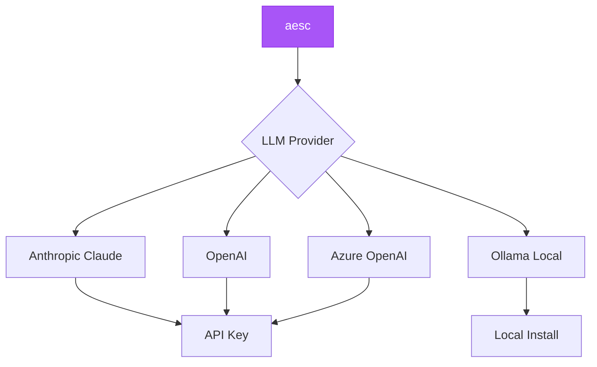

## Supported Providers

aesc supports multiple LLM providers for flexibility:



<CardGroup cols={2}>
  <Card title="Anthropic Claude" icon="sparkles">
    **Recommended for security work**

    Best reasoning, large context (200K tokens)
  </Card>
  <Card title="OpenAI" icon="openai">
    **Popular alternative**

    Good performance, widely available
  </Card>
  <Card title="Ollama" icon="server">
    **Local & Free**

    Privacy-focused, no API costs
  </Card>
  <Card title="Azure OpenAI" icon="microsoft">
    **Enterprise**

    For organizations using Azure
  </Card>
</CardGroup>

## Quick Start

<Tabs>
  <Tab title="Claude (Recommended)">
    <Steps>
      <Step title="Get API Key">
        1. Go to [console.anthropic.com](https://console.anthropic.com)
        2. Sign up or log in
        3. Navigate to API Keys
        4. Create new key
      </Step>

      <Step title="Configure aesc">
        ```bash
        export ANTHROPIC_API_KEY=sk-ant-your-key-here
        export AESC_MODEL_NAME=claude-sonnet-4-5-20250929
        aesc
        ```
      </Step>

      <Step title="Verify">
        ```bash
        aesc
        aesc> /status
        # Should show Anthropic provider
        ```
      </Step>
    </Steps>
  </Tab>

  <Tab title="OpenAI">
    <Steps>
      <Step title="Get API Key">
        1. Go to [platform.openai.com](https://platform.openai.com)
        2. Sign up or log in
        3. Navigate to API Keys
        4. Create new key
      </Step>

      <Step title="Configure aesc">
        ```bash
        export OPENAI_API_KEY=sk-your-key-here
        export AESC_MODEL_NAME=gpt-4
        aesc
        ```
      </Step>

      <Step title="Verify">
        ```bash
        aesc -c "hello"
        # Should respond using GPT-4
        ```
      </Step>
    </Steps>
  </Tab>

  <Tab title="Ollama (Free)">
    <Steps>
      <Step title="Install Ollama">
        ```bash
        # Linux/macOS
        curl -fsSL https://ollama.com/install.sh | sh

        # Or download from ollama.com
        ```
      </Step>

      <Step title="Pull a Model">
        ```bash
        ollama pull llama3
        # Or: mistral, codellama, etc.
        ```
      </Step>

      <Step title="Start Ollama">
        ```bash
        ollama serve
        # Runs on http://localhost:11434
        ```
      </Step>

      <Step title="Configure aesc">
        ```bash
        export OLLAMA_BASE_URL=http://localhost:11434/v1
        export AESC_MODEL_NAME=llama3
        aesc
        ```
      </Step>
    </Steps>
  </Tab>
</Tabs>

## Anthropic Claude

### Why Claude for Security?

- ✅ **Best reasoning** - Superior for complex security tasks
- ✅ **200K context** - Handle large logs, reports
- ✅ **Safety-focused** - Built-in guardrails
- ✅ **Latest knowledge** - Recent CVE information

### Configuration

<Tabs>
  <Tab title="Environment Variables">
    ```bash
    export ANTHROPIC_API_KEY=sk-ant-your-key-here
    export AESC_MODEL_NAME=claude-sonnet-4-5-20250929
    aesc
    ```
  </Tab>

  <Tab title="config.json">
    ```json
    {
      "providers": {
        "anthropic": {
          "type": "anthropic",
          "api_key": "sk-ant-your-key-here"
        }
      },
      "models": {
        "default": {
          "provider": "anthropic",
          "model": "claude-sonnet-4-5-20250929",
          "max_context_size": 200000
        }
      },
      "default_model": "default"
    }
    ```
  </Tab>

  <Tab title="Interactive Setup">
    ```bash
    aesc
    aesc> /setup
    # Select: Anthropic
    # Enter API key
    # Select model
    ```
  </Tab>
</Tabs>

### Available Models

| Model | Context | Best For |
|-------|---------|----------|
| `claude-sonnet-4-5-20250929` | 200K | **Security work** (recommended) |
| `claude-3-5-sonnet-20241022` | 200K | General tasks |
| `claude-3-opus-20240229` | 200K | Most capable, slower |

### Pricing

Sonnet 4.5 (recommended):
- **Input:** $3 / 1M tokens
- **Output:** $15 / 1M tokens

**Example costs:**
- Simple scan: ~$0.05
- Complex analysis: ~$0.50
- Full engagement: ~$5-10

## OpenAI

### Configuration

<Tabs>
  <Tab title="Environment Variables">
    ```bash
    export OPENAI_API_KEY=sk-your-key-here
    export AESC_MODEL_NAME=gpt-4
    aesc
    ```
  </Tab>

  <Tab title="config.json">
    ```json
    {
      "providers": {
        "openai": {
          "type": "openai_responses",
          "api_key": "sk-your-key-here"
        }
      },
      "models": {
        "default": {
          "provider": "openai",
          "model": "gpt-4",
          "max_context_size": 8192
        }
      },
      "default_model": "default"
    }
    ```
  </Tab>
</Tabs>

### Available Models

| Model | Context | Notes |
|-------|---------|-------|
| `gpt-4` | 8K | Standard, reliable |
| `gpt-4-turbo` | 128K | Larger context |
| `gpt-3.5-turbo` | 16K | Faster, cheaper |

<Info>
  **Tip:** Use GPT-4 Turbo for large log analysis
</Info>

### Pricing

GPT-4:
- **Input:** $30 / 1M tokens
- **Output:** $60 / 1M tokens

GPT-3.5 Turbo (cheaper):
- **Input:** $0.50 / 1M tokens
- **Output:** $1.50 / 1M tokens

## Ollama (Local & Free)

### Why Ollama?

- ✅ **Free** - No API costs
- ✅ **Private** - Data stays local
- ✅ **Fast** - No network latency
- ✅ **Offline** - Works without internet

### Installation

<Tabs>
  <Tab title="Linux">
    ```bash
    curl -fsSL https://ollama.com/install.sh | sh
    ```
  </Tab>

  <Tab title="macOS">
    ```bash
    # Download from ollama.com
    # Or use Homebrew
    brew install ollama
    ```
  </Tab>

  <Tab title="Windows">
    1. Download from [ollama.com](https://ollama.com)
    2. Run installer
    3. Ollama runs as service
  </Tab>

  <Tab title="Docker">
    ```bash
    docker run -d \
      -v ollama:/root/.ollama \
      -p 11434:11434 \
      --name ollama \
      ollama/ollama
    ```
  </Tab>
</Tabs>

### Popular Models

<Tabs>
  <Tab title="Llama 3">
    **Best for general security work**

    ```bash
    # Install
    ollama pull llama3

    # Configure aesc
    export AESC_MODEL_NAME=llama3
    aesc
    ```

    **Sizes:**
    - `llama3:8b` - 4.7GB (recommended)
    - `llama3:70b` - 40GB (more capable, needs GPU)
  </Tab>

  <Tab title="Mistral">
    **Fast and efficient**

    ```bash
    ollama pull mistral
    export AESC_MODEL_NAME=mistral
    aesc
    ```

    **Size:** 4.1GB
  </Tab>

  <Tab title="CodeLlama">
    **Code-focused**

    ```bash
    ollama pull codellama
    export AESC_MODEL_NAME=codellama
    aesc
    ```

    **Size:** 3.8GB
  </Tab>

  <Tab title="Qwen">
    **Strong reasoning**

    ```bash
    ollama pull qwen2.5-coder
    export AESC_MODEL_NAME=qwen2.5-coder
    aesc
    ```

    **Size:** 7.6GB
  </Tab>
</Tabs>

### Configuration

<Tabs>
  <Tab title="Default (localhost)">
    ```bash
    # Ollama running on host
    export OLLAMA_BASE_URL=http://localhost:11434/v1
    export AESC_MODEL_NAME=llama3
    aesc
    ```
  </Tab>

  <Tab title="Docker (from container)">
    ```bash
    # aesc in Docker, Ollama on host
    docker run -it --rm \
      -e OLLAMA_BASE_URL=http://host.docker.internal:11434/v1 \
      -e AESC_MODEL_NAME=llama3 \
      ghcr.io/akaeli-aesc/aesc-cli:latest
    ```
  </Tab>

  <Tab title="Remote Ollama">
    ```bash
    # Ollama on different server
    export OLLAMA_BASE_URL=http://ollama-server:11434/v1
    export AESC_MODEL_NAME=llama3
    aesc
    ```
  </Tab>
</Tabs>

### Hardware Requirements

| Model Size | RAM | VRAM (GPU) | Speed |
|------------|-----|------------|-------|
| 7B-8B | 8GB | 6GB+ | Fast |
| 13B | 16GB | 10GB+ | Medium |
| 70B+ | 64GB+ | 40GB+ | Slow |

<Info>
  **Tip:** 8B models (llama3:8b) work well on most systems
</Info>

## Azure OpenAI

For organizations using Azure:

```json
// ~/.aesc/config.json
{
  "providers": {
    "azure": {
      "type": "openai_responses",
      "api_key": "your-azure-key",
      "base_url": "https://your-resource.openai.azure.com/",
      "api_version": "2023-05-15"
    }
  },
  "models": {
    "default": {
      "provider": "azure",
      "model": "gpt-4",
      "max_context_size": 8192
    }
  },
  "default_model": "default"
}
```

**Required:**
- Azure OpenAI resource
- Model deployment
- API endpoint URL

## Comparison

<Tabs>
  <Tab title="Feature Comparison">
    | Feature | Claude | OpenAI | Ollama |
    |---------|--------|--------|--------|
    | **Context Size** | 200K | 8K-128K | 8K |
    | **Cost** | $3-15/1M | $0.5-60/1M | Free |
    | **Speed** | Fast | Fast | Very Fast |
    | **Privacy** | Cloud | Cloud | Local |
    | **Reasoning** | ⭐⭐⭐⭐⭐ | ⭐⭐⭐⭐ | ⭐⭐⭐ |
    | **Code** | ⭐⭐⭐⭐ | ⭐⭐⭐⭐⭐ | ⭐⭐⭐ |
    | **Security** | ⭐⭐⭐⭐⭐ | ⭐⭐⭐⭐ | ⭐⭐⭐ |
  </Tab>

  <Tab title="Use Case Recommendations">
    **For Security Work:**
    - 🥇 **Claude Sonnet 4.5** - Best reasoning
    - 🥈 **GPT-4** - Good alternative
    - 🥉 **Ollama Llama3** - Privacy-focused

    **For Cost Optimization:**
    - 🥇 **Ollama** - Free
    - 🥈 **GPT-3.5** - Cheap
    - 🥉 **Claude** - Best value

    **For Privacy:**
    - 🥇 **Ollama** - 100% local
    - 🥈 **Self-hosted** - Full control
    - 🥉 **Cloud** - Check terms

    **For Large Context:**
    - 🥇 **Claude** - 200K tokens
    - 🥈 **GPT-4 Turbo** - 128K tokens
    - 🥉 **Standard models** - 8K tokens
  </Tab>
</Tabs>

## Troubleshooting

<AccordionGroup>
  <Accordion title="API Key Not Working">
    **Symptoms:** "Authentication failed" error

    **Solutions:**
    - Verify key is correct (no extra spaces)
    - Check key hasn't expired
    - Ensure billing is enabled
    - Test with curl:

    <Tabs>
      <Tab title="Anthropic">
        ```bash
        curl https://api.anthropic.com/v1/messages \
          -H "x-api-key: $ANTHROPIC_API_KEY" \
          -H "anthropic-version: 2023-06-01"
        ```
      </Tab>
      <Tab title="OpenAI">
        ```bash
        curl https://api.openai.com/v1/models \
          -H "Authorization: Bearer $OPENAI_API_KEY"
        ```
      </Tab>
    </Tabs>
  </Accordion>

  <Accordion title="Ollama Connection Failed">
    **Symptoms:** "Cannot connect to Ollama"

    **Solutions:**
    1. Check Ollama is running:
       ```bash
       curl http://localhost:11434/api/tags
       ```

    2. Start Ollama if not running:
       ```bash
       ollama serve
       ```

    3. Check model is installed:
       ```bash
       ollama list
       ```

    4. Pull model if missing:
       ```bash
       ollama pull llama3
       ```
  </Accordion>

  <Accordion title="Context Too Large">
    **Symptoms:** "Context size exceeded" error

    **Solutions:**
    - Use model with larger context:
      ```bash
      export AESC_MODEL_NAME=claude-sonnet-4-5-20250929  # 200K
      ```

    - Clear history:
      ```bash
      aesc
      aesc> /clear
      ```

    - Break task into smaller chunks
  </Accordion>

  <Accordion title="Slow Responses">
    **Causes & Solutions:**

    **Cloud providers:**
    - Check internet connection
    - Try different model
    - Check provider status page

    **Ollama:**
    - Use smaller model (8B instead of 70B)
    - Add GPU acceleration
    - Increase system RAM
  </Accordion>
</AccordionGroup>

## Best Practices

<CardGroup cols={2}>
  <Card title="Start with Claude" icon="sparkles">
    Best for security work, try first
  </Card>
  <Card title="Use Ollama for Privacy" icon="lock">
    Keep sensitive data local
  </Card>
  <Card title="Set Budget Alerts" icon="bell">
    Monitor API usage costs
  </Card>
  <Card title="Test Locally First" icon="vial">
    Use Ollama for testing workflows
  </Card>
  <Card title="Cache Responses" icon="database">
    Save results to reduce API calls
  </Card>
  <Card title="Monitor Context Size" icon="chart-line">
    Clear history when context grows
  </Card>
</CardGroup>

## Next Steps

<CardGroup cols={2}>
  <Card
    title="Configuration"
    icon="gear"
    href="/api-reference/configuration-file"
  >
    Detailed config.json setup
  </Card>
  <Card
    title="Quick Start"
    icon="rocket"
    href="/quickstart"
  >
    Get started with aesc
  </Card>
  <Card
    title="Troubleshooting"
    icon="wrench"
    href="/guides/troubleshooting"
  >
    Common LLM issues
  </Card>
  <Card
    title="CLI Commands"
    icon="terminal"
    href="/api-reference/cli-commands"
  >
    Command reference
  </Card>
</CardGroup>
