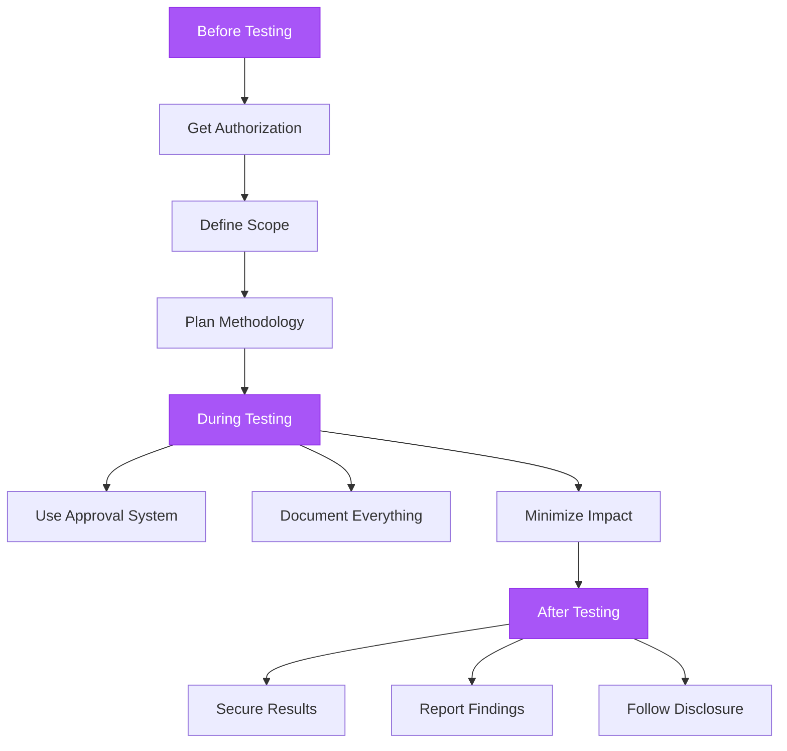
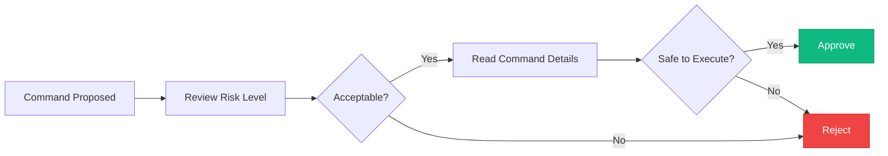
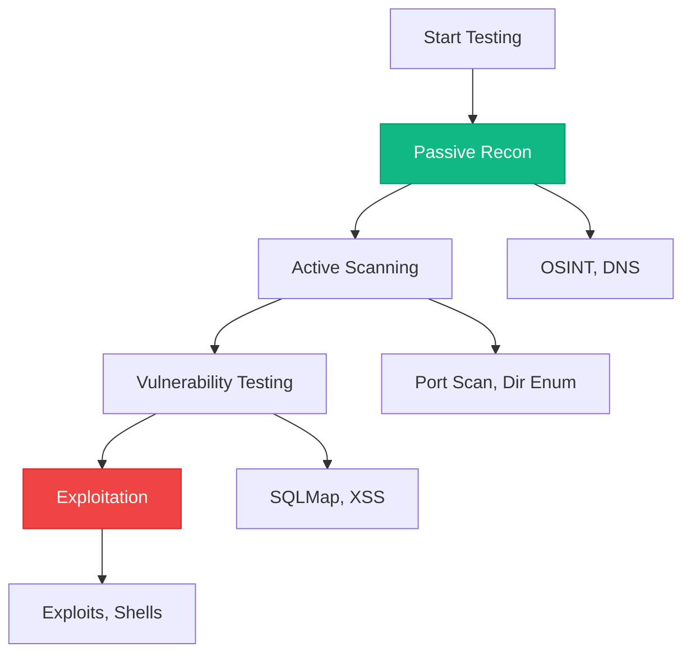
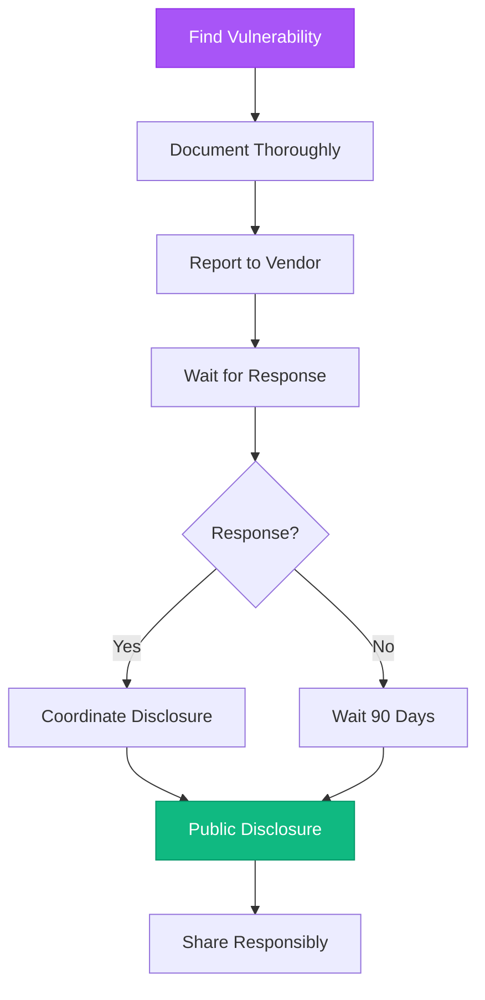

## Ethical Hacking Principles



<Warning>
  **Always get proper authorization before security testing!**

  Unauthorized testing is illegal and unethical.
</Warning>

## Authorization & Scope

### Get Written Permission

<Steps>
  <Step title="Request Authorization">
    **Required documents:**
    - Written permission from asset owner
    - Signed testing agreement
    - Clear scope definition
    - Timeline and constraints
  </Step>

  <Step title="Define Scope">
    **Must include:**
    ```
    In-Scope:
    - IP ranges: 192.168.1.0/24
    - Domains: *.example.com
    - Applications: webmail.example.com

    Out-of-Scope:
    - Production databases
    - Customer data
    - Third-party services
    ```
  </Step>

  <Step title="Document Everything">
    - Date and time of authorization
    - Authorized person's details
    - Scope boundaries
    - Approved testing methods
    - Emergency contacts
  </Step>
</Steps>

### Verify Scope Constantly

```bash
# Before each test
aesc> Am I authorized to test example.com?
aesc> Is 192.168.1.1 in scope?
aesc> Can I run this exploit?
```

<Info>
  **Tip:** Keep authorization documents accessible during testing
</Info>

## Using the Approval System

### Review Every Command



**What to check:**
- ✅ Target is in scope
- ✅ Risk level is appropriate
- ✅ Command makes sense
- ✅ No dangerous patterns (unless intended)
- ✅ Have backup plan

### Understand Risk Levels

<Tabs>
  <Tab title="🟢 Low Risk">
    **Safe operations:**
    - Reading files
    - Searching content
    - Web searches

    **Can approve freely**
  </Tab>

  <Tab title="🟡 Medium Risk">
    **Scanning operations:**
    - Network discovery
    - Port scanning
    - Directory enumeration

    **Check target is authorized**
  </Tab>

  <Tab title="🟠 High Risk">
    **Active testing:**
    - SQL injection testing
    - Authentication attacks
    - Vulnerability exploitation

    **Verify scope and document**
  </Tab>

  <Tab title="🔴 Critical Risk">
    **Exploitation:**
    - Running exploits
    - System-level commands
    - Data modification

    **Extra caution required!**
  </Tab>
</Tabs>

### When to Use --yolo

<AccordionGroup>
  <Accordion title="✅ Safe for YOLO Mode">
    **Acceptable scenarios:**
    - Lab environments
    - Personal test systems
    - Automated CI/CD (controlled)
    - Isolated Docker containers
    - Non-production demos

    ```bash
    # Lab testing
    aesc --yolo -c "scan lab-network"
    ```
  </Accordion>

  <Accordion title="❌ Never Use YOLO For">
    **Dangerous scenarios:**
    - Production systems
    - Client engagements
    - Unauthorized targets
    - Systems with real data
    - Network scanning without permission

    <Warning>
      YOLO mode bypasses all safety checks!
    </Warning>
  </Accordion>
</AccordionGroup>

## Minimizing Impact

### Start with Least Invasive



**Methodology:**
1. **Passive reconnaissance** - No direct contact
2. **Active scanning** - Gentle probing
3. **Vulnerability testing** - Careful exploitation attempts
4. **Full exploitation** - Only with explicit permission

### Rate Limiting

```bash
# Slow down scans
aesc> scan target.com with slow timing

# Limit concurrent connections
aesc> enumerate directories with rate limit

# Space out requests
aesc> test SQL injection slowly
```

<Info>
  **Tip:** Use `--timing` flags in tools like nmap to reduce impact
</Info>

### Avoid Denial of Service

**Don't:**
- ❌ Run aggressive fuzzing on production
- ❌ Flood services with requests
- ❌ Exploit memory leaks repeatedly
- ❌ Crash services intentionally

**Do:**
- ✅ Test in staging first
- ✅ Use rate limiting
- ✅ Schedule tests during maintenance windows
- ✅ Have rollback plan ready

## Data Handling

### Secure Sensitive Information

<Tabs>
  <Tab title="During Testing">
    **Protect:**
    - API keys, passwords
    - Session tokens
    - Database dumps
    - Personal information

    ```bash
    # Store securely
    aesc> save credentials to /secure/results/creds.enc
    ```
  </Tab>

  <Tab title="After Testing">
    **Clean up:**
    ```bash
    # Encrypt results
    gpg -c results/findings.txt

    # Secure delete
    shred -u temp/passwords.txt

    # Remove from system
    rm -rf /tmp/aesc-session-*
    ```
  </Tab>

  <Tab title="Reporting">
    **Sanitize reports:**
    - Remove real credentials
    - Redact sensitive IPs
    - Use placeholders
    - Encrypt before sending

    ```
    Password: [REDACTED]
    Database: customer_db (actual name redacted)
    ```
  </Tab>
</Tabs>

### Results Directory

```bash
# Set secure permissions
chmod 700 /results

# Encrypt sensitive findings
gpg -c /results/scan-findings.json

# Remove after reporting
shred -u /results/*
```

## Documentation & Reporting

### Document Everything

**Record:**
- 📅 Date and time
- 🎯 Target and scope
- 🔨 Tools and commands used
- 📊 Results and findings
- ⚠️ Issues encountered
- 💡 Recommendations

**Example notes:**
```markdown
## Penetration Test Log

**Date:** 2024-01-15 14:30 UTC
**Tester:** Security Team
**Target:** example.com (authorized)

### Actions Taken:
1. Port scan: nmap -sV example.com
   - Result: 3 open ports (80, 443, 22)

2. Web enumeration: gobuster dir
   - Result: Found /admin endpoint

3. SQL injection test: sqlmap
   - Result: Vulnerable parameter found
   - Exploit: [DETAILS]

### Findings:
- Critical: SQL injection in login form
- High: Admin panel exposed
- Medium: Outdated SSH version

### Recommendations:
1. Patch SQL injection immediately
2. Restrict /admin access
3. Update SSH to latest version
```

### Report Structure

<Tabs>
  <Tab title="Executive Summary">
    **For management:**
    - High-level findings
    - Business impact
    - Risk ratings
    - Remediation timeline

    ```markdown
    # Executive Summary

    Critical vulnerabilities discovered:
    - SQL injection (CVSS 9.8)
    - Exposed admin panel (CVSS 7.5)

    Immediate action required.
    ```
  </Tab>

  <Tab title="Technical Details">
    **For security team:**
    - Detailed findings
    - Reproduction steps
    - Proof of concept
    - Technical remediation

    ```markdown
    # Technical Findings

    ## SQL Injection

    **Location:** /login?user=admin
    **Payload:** ' OR '1'='1
    **Impact:** Full database access

    **Reproduction:**
    1. Navigate to /login
    2. Enter payload in username
    3. Observe unauthorized access
    ```
  </Tab>

  <Tab title="Remediation Guide">
    **For developers:**
    - Fix instructions
    - Code examples
    - Testing verification
    - Prevention tips

    ```markdown
    # Remediation Guide

    ## SQL Injection Fix

    **Current code:**
    query = "SELECT * FROM users WHERE user='" + input + "'"

    **Fixed code:**
    query = "SELECT * FROM users WHERE user=?"
    cursor.execute(query, (input,))
    ```
  </Tab>
</Tabs>

## Responsible Disclosure

### Disclosure Timeline



### Reporting Process

<Steps>
  <Step title="Initial Report">
    **Include:**
    - Vulnerability description
    - Affected versions/systems
    - Reproduction steps
    - Proof of concept
    - Suggested remediation

    **Send to:**
    - security@company.com
    - Bug bounty platform
    - CERT/CC (if critical)
  </Step>

  <Step title="Follow Standard Timeline">
    **Typical disclosure:**
    - Day 0: Report vulnerability
    - Day 7: Expect acknowledgment
    - Day 30: Status update
    - Day 90: Coordinated disclosure

    **Critical vulnerabilities:**
    - Shorter timelines may apply
    - Coordinate with vendor
  </Step>

  <Step title="Public Disclosure">
    **After fix deployed:**
    - Write detailed advisory
    - Share on security mailing lists
    - Update CVE database
    - Blog post (optional)

    **Include:**
    - Timeline of discovery
    - Technical details
    - Credit to researchers
    - Vendor's response
  </Step>
</Steps>

## Compliance & Legal

### Know the Laws

<AccordionGroup>
  <Accordion title="Computer Fraud and Abuse Act (CFAA) - US">
    **Prohibits:**
    - Unauthorized access to computer systems
    - Exceeding authorized access
    - Causing damage to systems

    **Penalties:** Fines and imprisonment

    **Safe harbor:** Written authorization required
  </Accordion>

  <Accordion title="Computer Misuse Act - UK">
    **Offenses:**
    - Unauthorized access
    - Unauthorized modification
    - Making malware available

    **Penalties:** Up to 10 years imprisonment
  </Accordion>

  <Accordion title="GDPR - EU">
    **Applies to:**
    - Processing personal data
    - EU citizens' data

    **Requirements:**
    - Lawful basis for processing
    - Data protection measures
    - Breach notification

    **Violations:** Up to €20M or 4% revenue
  </Accordion>
</AccordionGroup>

### Stay Compliant

<CardGroup cols={2}>
  <Card title="Get Written Authorization" icon="file-signature">
    Always have documented permission
  </Card>
  <Card title="Follow Scope" icon="bullseye">
    Stay within defined boundaries
  </Card>
  <Card title="Protect Data" icon="lock">
    Encrypt sensitive information
  </Card>
  <Card title="Report Properly" icon="file-lines">
    Follow responsible disclosure
  </Card>
</CardGroup>

## Emergency Procedures

### If Something Goes Wrong

<Tabs>
  <Tab title="Service Down">
    **Actions:**
    1. Stop all testing immediately
    2. Notify client/stakeholder
    3. Document what happened
    4. Assist with recovery
    5. Write incident report

    ```bash
    # Emergency stop
    Ctrl+C  # Stop aesc

    # Document
    aesc> save session log to /emergency/incident.log
    ```
  </Tab>

  <Tab title="Data Breach">
    **Actions:**
    1. Stop data collection
    2. Secure any extracted data
    3. Notify affected parties
    4. Follow breach protocol
    5. Legal consultation

    **Contacts:**
    - Client security team
    - Legal counsel
    - Regulatory authorities (if required)
  </Tab>

  <Tab title="Scope Violation">
    **Actions:**
    1. Stop immediately
    2. Notify client
    3. Document violation
    4. Assess impact
    5. Corrective measures

    **Report:**
    - What was accessed
    - How it happened
    - Steps taken to remediate
  </Tab>
</Tabs>

## Checklists

### Pre-Engagement

- [ ] Written authorization received
- [ ] Scope clearly defined
- [ ] Timeline agreed upon
- [ ] Emergency contacts established
- [ ] Insurance/liability covered
- [ ] Tools and methodology approved
- [ ] Communication plan set

### During Engagement

- [ ] Review approvals for each command
- [ ] Stay within scope
- [ ] Document all actions
- [ ] Monitor for unexpected behavior
- [ ] Regular status updates
- [ ] Secure sensitive data immediately
- [ ] Follow rate limiting

### Post-Engagement

- [ ] Testing complete
- [ ] All data collected securely
- [ ] Report written
- [ ] Findings validated
- [ ] Remediation recommended
- [ ] Client debriefed
- [ ] Cleanup completed

## Resources

<CardGroup cols={2}>
  <Card title="OWASP" icon="shield-halved">
    Testing guides and best practices

    [owasp.org](https://owasp.org)
  </Card>
  <Card title="PTES" icon="book">
    Penetration Testing Execution Standard

    [pentest-standard.org](http://www.pentest-standard.org)
  </Card>
  <Card title="NIST" icon="building-columns">
    Cybersecurity framework

    [nist.gov/cyberframework](https://www.nist.gov/cyberframework)
  </Card>
  <Card title="Bug Bounty Platforms" icon="bug">
    Practice legally

    HackerOne, Bugcrowd
  </Card>
</CardGroup>

## Next Steps

<CardGroup cols={2}>
  <Card
    title="Risk-Based Approvals"
    icon="shield-check"
    href="/features/risk-based-approvals"
  >
    Understand the approval system
  </Card>
  <Card
    title="Docker Usage"
    icon="docker"
    href="/guides/docker-usage"
  >
    Isolated testing environment
  </Card>
  <Card
    title="Quick Start"
    icon="rocket"
    href="/quickstart"
  >
    Get started safely
  </Card>
  <Card
    title="Troubleshooting"
    icon="wrench"
    href="/guides/troubleshooting"
  >
    Common issues
  </Card>
</CardGroup>

---

<Warning>
  **Remember:** With great power comes great responsibility.

  Use aesc ethically, legally, and always with proper authorization.
</Warning>
