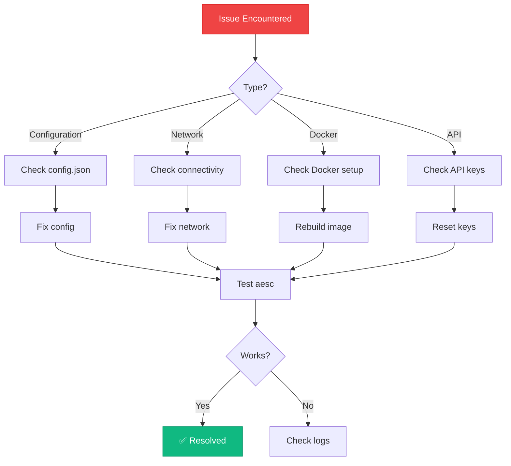
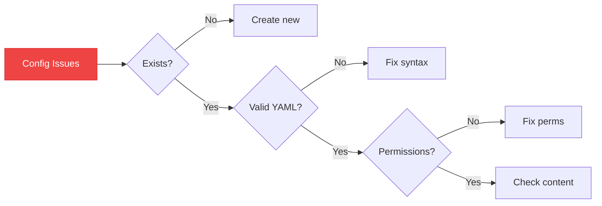
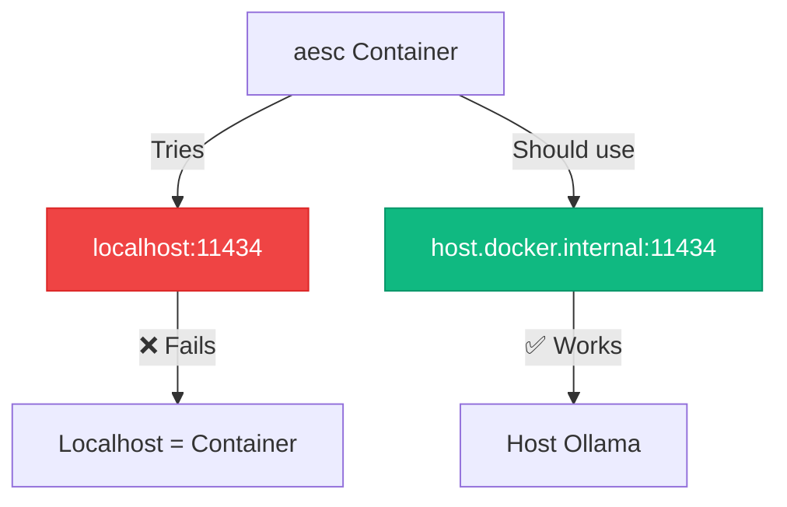
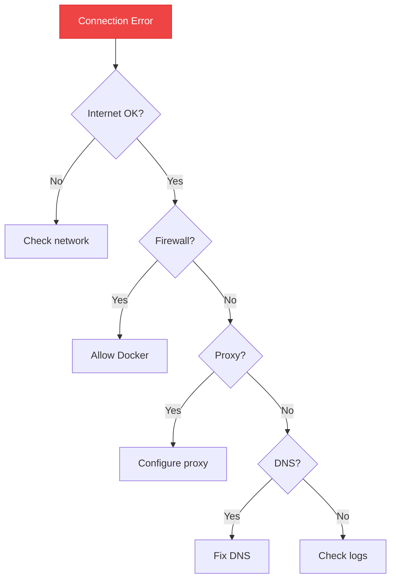

## Issue Resolution Flow



## Configuration Issues

### API Key Not Working

**Symptoms:**
- "Model not set" error
- "Authentication failed"
- LLM not responding

<Tabs>
  <Tab title="Quick Fix">
    ```bash
    # Verify API key is set
    echo $ANTHROPIC_API_KEY

    # Set API key
    export ANTHROPIC_API_KEY=sk-ant-your-key-here
    export AESC_MODEL_NAME=claude-sonnet-4-5-20250929

    # Test aesc
    aesc --version
    aesc
    ```
  </Tab>

  <Tab title="Using /setup">
    ```bash
    aesc
    > /setup

    # Follow prompts:
    # 1. Select provider (Anthropic/OpenAI/Ollama)
    # 2. Enter API key
    # 3. Select model
    ```
  </Tab>

  <Tab title="Config File">
    ```bash
    # Edit config manually
    nano ~/.aesc/config.json
    ```

    ```yaml
    providers:
      anthropic:
        type: anthropic
        api_key: sk-ant-your-key-here

    models:
      default:
        provider: anthropic
        model: claude-sonnet-4-5-20250929

    default_model: default
    ```
  </Tab>
</Tabs>

<AccordionGroup>
  <Accordion title="Test API Key">
    <Tabs>
      <Tab title="Anthropic">
        ```bash
        curl https://api.anthropic.com/v1/messages \
          -H "x-api-key: $ANTHROPIC_API_KEY" \
          -H "anthropic-version: 2023-06-01" \
          -H "content-type: application/json" \
          -d '{
            "model": "claude-sonnet-4-5-20250929",
            "max_tokens": 10,
            "messages": [{"role": "user", "content": "Hi"}]
          }'
        ```
      </Tab>

      <Tab title="OpenAI">
        ```bash
        curl https://api.openai.com/v1/models \
          -H "Authorization: Bearer $OPENAI_API_KEY"
        ```
      </Tab>

      <Tab title="Ollama">
        ```bash
        curl http://localhost:11434/api/tags
        ```
      </Tab>
    </Tabs>
  </Accordion>

  <Accordion title="Common API Key Errors">
    | Error | Cause | Solution |
    |-------|-------|----------|
    | Invalid API key | Key copied incorrectly | Check for extra spaces |
    | Key expired | Account inactive | Check billing/account |
    | Rate limit exceeded | Too many requests | Wait or upgrade plan |
    | Model not found | Wrong model name | Use correct model ID |
  </Accordion>
</AccordionGroup>

### Config File Issues

**Problem:** Config not loading or corrupted



<Steps>
  <Step title="Locate config">
    ```bash
    # aesc stores its config here:
    ls ~/.aesc/config.json
    ```
  </Step>

  <Step title="Validate JSON">
    ```bash
    # Validate JSON syntax
    python -c "import json, os; json.load(open(os.path.expanduser('~/.aesc/config.json')))"
    ```
  </Step>

  <Step title="Fix permissions">
    ```bash
    chmod 600 ~/.aesc/config.json
    ```
  </Step>

  <Step title="Reset config">
    ```bash
    # Backup old config
    mv ~/.aesc/config.json ~/.aesc/config.json.bak

    # Create new
    aesc
    > /setup
    ```
  </Step>
</Steps>

## Docker Issues

### Container Exits Immediately

**Cause:** Missing interactive flags

<CodeGroup>

```bash Correct
docker run -it --rm aesc:latest
```

```bash Wrong
docker run aesc:latest
```

</CodeGroup>

**Flags explained:**
- `-i` → Keep STDIN open
- `-t` → Allocate pseudo-TTY
- `--rm` → Remove container after exit

### Cannot Connect to Ollama

**Problem:** aesc can't reach Ollama running on host



<Steps>
  <Step title="Verify Ollama running">
    ```bash
    # On host machine
    curl http://localhost:11434/api/tags

    # Should see list of models
    ```
  </Step>

  <Step title="Use correct URL in container">
    ```bash
    docker run -it --rm \
      -e OLLAMA_BASE_URL=http://host.docker.internal:11434/v1 \
      -e AESC_MODEL_NAME=llama3 \
      aesc:latest
    ```

    <Info>
      `host.docker.internal` resolves to host machine from container
    </Info>
  </Step>

  <Step title="Or use host network">
    ```bash
    docker run -it --rm \
      --network host \
      -e OLLAMA_BASE_URL=http://localhost:11434/v1 \
      aesc:latest
    ```
  </Step>
</Steps>

### Docker Build Fails

**Symptoms:**
- Build errors
- Out of disk space
- Network timeouts

<Tabs>
  <Tab title="Clean Rebuild">
    ```bash
    # Remove old images
    docker rmi aesc:latest

    # Clean build
    docker build --no-cache -t aesc:latest .
    ```
  </Tab>

  <Tab title="Free Disk Space">
    ```bash
    # Check disk usage
    docker system df

    # Clean up
    docker system prune -a

    # Remove dangling images
    docker image prune -a
    ```
  </Tab>

  <Tab title="Verbose Build">
    ```bash
    # See detailed build output
    docker build --progress=plain --no-cache -t aesc:latest .
    ```
  </Tab>
</Tabs>

### Permission Denied Errors

**Problem:** Cannot access network or write files

<AccordionGroup>
  <Accordion title="Network Operations">
    **Cause:** Missing NET_RAW/NET_ADMIN capabilities

    ```bash
    # Solution 1: Host network
    docker run -it --rm --network host aesc:latest

    # Solution 2: Add capabilities
    docker run -it --rm \
      --cap-add NET_RAW \
      --cap-add NET_ADMIN \
      aesc:latest
    ```
  </Accordion>

  <Accordion title="File Write Errors">
    **Cause:** Volume mount permissions

    ```bash
    # Fix directory permissions
    mkdir -p results config
    chmod 755 results config

    # Or run with user mapping
    docker run -it --rm \
      -u $(id -u):$(id -g) \
      -v $(pwd)/results:/results \
      aesc:latest
    ```
  </Accordion>
</AccordionGroup>

## Network Issues

### Connection Timeout

**Problem:** Cannot connect to API endpoints



<Steps>
  <Step title="Test connectivity">
    ```bash
    # Test from host
    curl https://api.anthropic.com
    curl https://api.openai.com

    # Test from container
    docker run --rm aesc:latest curl https://api.anthropic.com
    ```
  </Step>

  <Step title="Check Docker network">
    ```bash
    # Use host network
    docker run -it --rm --network host aesc:latest

    # Or check bridge network
    docker network inspect bridge
    ```
  </Step>

  <Step title="Fix firewall">
    ```bash
    # Allow Docker subnet
    sudo ufw allow from 172.16.0.0/12

    # Or disable firewall temporarily (testing only!)
    sudo ufw disable
    ```
  </Step>
</Steps>

### DNS Resolution Fails

**Problem:** Cannot resolve domain names

```bash
# Fix: Use Google DNS
docker run -it --rm \
  --dns 8.8.8.8 \
  --dns 8.8.4.4 \
  aesc:latest

# Or in docker-compose.yml:
dns:
  - 8.8.8.8
  - 8.8.4.4
```

## Performance Issues

### Slow Startup

**Causes & Solutions:**

<AccordionGroup>
  <Accordion title="UV Hardlink Warnings">
    **Symptom:** Warnings about falling back to copy mode

    **Solution:**
    ```bash
    # Set environment variable
    docker run -it --rm \
      -e UV_LINK_MODE=copy \
      -e UV_NO_PROGRESS=1 \
      aesc:latest
    ```

    This is already set in official Docker images.
  </Accordion>

  <Accordion title="Cold Start">
    **Cause:** First run needs to download/extract

    **Solution:**
    - Increase Docker resources (CPU/RAM)
    - Use SSD for Docker storage
    - Wait for initial setup to complete
  </Accordion>

  <Accordion title="Large Context">
    **Cause:** Processing large files/contexts

    **Solution:**
    - Use model with larger context
    - Break tasks into smaller chunks
    - Clear session history: `/clear`
  </Accordion>
</AccordionGroup>

### High Resource Usage

```bash
# Set resource limits
docker run -it --rm \
  --memory="2g" \
  --cpus="2" \
  aesc:latest

# Monitor usage
docker stats
```

## LLM Provider Issues

### Model Not Found

**Error:** "Model claude-sonnet-4-5-20250929 not found"

<Tabs>
  <Tab title="Anthropic">
    **Available models:**
    - `claude-sonnet-4-5-20250929` (latest)
    - `claude-3-5-sonnet-20241022`
    - `claude-3-opus-20240229`

    ```bash
    export AESC_MODEL_NAME=claude-3-5-sonnet-20241022
    ```
  </Tab>

  <Tab title="OpenAI">
    **Available models:**
    - `gpt-4`
    - `gpt-4-turbo`
    - `gpt-3.5-turbo`

    ```bash
    export AESC_MODEL_NAME=gpt-4
    ```
  </Tab>

  <Tab title="Ollama">
    **Check installed models:**
    ```bash
    ollama list
    ```

    **Install model:**
    ```bash
    ollama pull llama3
    ollama pull mistral
    ollama pull codellama
    ```
  </Tab>
</Tabs>

### Context Size Exceeded

**Error:** "Context size exceeded"

```bash
# Use model with larger context
export AESC_MODEL_NAME=claude-sonnet-4-5-20250929  # 200K context

# Or clear history
aesc
> /clear
```

**Context sizes:**
| Model | Context |
|-------|---------|
| Claude Sonnet 4.5 | 200K |
| GPT-4 Turbo | 128K |
| GPT-4 | 8K |
| Llama 3 | 8K |

## Debugging

### Enable Debug Logging

```bash
# Set log level
export AESC_LOG_LEVEL=DEBUG

# Run aesc
aesc

# Or in docker-compose.yml:
environment:
  - AESC_LOG_LEVEL=DEBUG
```

### Check Logs

```bash
# Docker container logs
docker logs <container-id>

# aesc application logs
cat ~/.aesc/aesc.log

# Follow logs in real-time
tail -f ~/.aesc/aesc.log
```

### Verbose Output

```bash
# Verbose Docker build
docker build --progress=plain -t aesc:latest .

# Verbose Docker run
docker run -it --rm aesc:latest -vvv
```

## UI/UX Issues

### Cannot Select or Copy Text

**Problem:** Text selection doesn't work in aesc interactive mode

**Cause:** Textual framework captures mouse events for the TUI

<Info>
  This is expected behavior - TUIs take control of the terminal for rich interactions.
</Info>

**Solutions:**

<Tabs>
  <Tab title="Terminal Bypass (Recommended)">
    **Use modifier key + mouse to restore native terminal selection:**

    | Terminal | Modifier Key | Usage |
    |----------|-------------|-------|
    | **iTerm2** (macOS) | `Option` | Hold `Option` + drag mouse to select |
    | **Gnome Terminal** (Linux) | `Shift` | Hold `Shift` + drag mouse to select |
    | **Windows Terminal** | `Shift` | Hold `Shift` + drag mouse to select |
    | **Most terminals** | `Shift` | Try `Shift` first, check docs if fails |

    <Steps>
      <Step title="Hold modifier key">
        Press and hold `Shift` (or `Option` on macOS)
      </Step>
      <Step title="Select text">
        Click and drag with mouse to select text
      </Step>
      <Step title="Copy">
        Release mouse - text is copied to terminal buffer
      </Step>
      <Step title="Paste">
        Use `Ctrl+Shift+V` or right-click to paste
      </Step>
    </Steps>

    <Warning>
      This feature depends on your terminal emulator. If `Shift` doesn't work, check your terminal's documentation.
    </Warning>
  </Tab>

  <Tab title="Export Command (Coming Soon)">
    ```bash
    aesc
    > /export conversation.txt      # Save to file
    > /copy last 5                   # Copy last 5 messages
    > /export markdown results.md    # Export as markdown
    ```

    <Info>
      This feature is planned for v0.2.0. Track progress at [#issue-number](https://github.com/akaeli-aesc/aesc-cli/issues)
    </Info>
  </Tab>

  <Tab title="Log Output">
    **Redirect output to file during run:**

    ```bash
    # Using tee (keeps terminal interactive)
    docker run -it --rm aesc:latest | tee conversation.log

    # Or enable logging in config
    docker run -it --rm \
      -e AESC_LOG_OUTPUT=true \
      -v $(pwd)/logs:/logs \
      aesc:latest
    ```

    This captures all terminal output to a file you can copy from.
  </Tab>
</Tabs>

<AccordionGroup>
  <Accordion title="Why doesn't text selection work by default?">
    Textual (and all TUI frameworks) need mouse control for:
    - Scroll with mouse wheel/touchpad
    - Click buttons and inputs
    - Interactive widgets

    When the TUI captures mouse events, native terminal selection is disabled. The modifier key (Shift/Option) tells your terminal to bypass the TUI temporarily.
  </Accordion>

  <Accordion title="Terminal doesn't support bypass?">
    Some terminal emulators (especially embedded terminals like VS Code's integrated terminal) may not support the modifier key bypass.

    **Workarounds:**
    1. Use a standalone terminal (iTerm2, Gnome Terminal, Windows Terminal)
    2. Use the log output method (Tab 3 above)
    3. Wait for `/export` command in v0.2.0
  </Accordion>

  <Accordion title="Reference: Textual FAQ">
    This is documented in Textual's official FAQ:
    https://textual.textualize.io/FAQ/#how-can-i-select-and-copy-text-in-a-textual-app
  </Accordion>
</AccordionGroup>

---

## Getting Help

<CardGroup cols={2}>
  <Card title="GitHub Issues" icon="github">
    Report bugs at [github.com/akaeli-aesc/aesc-cli/issues](https://github.com/akaeli-aesc/aesc-cli/issues)
  </Card>
  <Card title="Discussions" icon="comments">
    Ask questions at [GitHub Discussions](https://github.com/akaeli-aesc/aesc-cli/discussions)
  </Card>
  <Card title="Documentation" icon="book">
    Browse full docs at [docs.akæli.com](https://docs.akæli.com)
  </Card>
</CardGroup>

### Bug Report Template

When creating an issue, include:

```bash
# System info
aesc --version
docker --version
uname -a

# Error message
# (paste full error)

# Steps to reproduce
# 1. Run command X
# 2. See error Y

# Expected behavior
# Should do Z

# Logs
cat ~/.aesc/aesc.log
```

## Quick Fixes Summary

<Tabs>
  <Tab title="Config Issues">
    ```bash
    # Reset config
    rm ~/.aesc/config.json
    aesc
    > /setup

    # Or set env vars
    export ANTHROPIC_API_KEY=sk-ant-...
    export AESC_MODEL_NAME=claude-sonnet-4-5-20250929
    ```
  </Tab>

  <Tab title="Docker Issues">
    ```bash
    # Rebuild image
    docker build --no-cache -t aesc:latest .

    # Clean system
    docker system prune -a

    # Fix permissions
    chmod 755 results config
    ```
  </Tab>

  <Tab title="Network Issues">
    ```bash
    # Use host network
    docker run -it --rm --network host aesc:latest

    # Add DNS
    docker run -it --rm --dns 8.8.8.8 aesc:latest

    # Check connectivity
    curl https://api.anthropic.com
    ```
  </Tab>

  <Tab title="LLM Issues">
    ```bash
    # Test API key
    curl https://api.anthropic.com/v1/messages \
      -H "x-api-key: $ANTHROPIC_API_KEY"

    # Use different model
    export AESC_MODEL_NAME=claude-3-5-sonnet-20241022

    # Clear session
    aesc
    > /clear
    ```
  </Tab>
</Tabs>

## Still Having Issues?

<Steps>
  <Step title="Search existing issues">
    Check if someone else had the same problem:
    https://github.com/akaeli-aesc/aesc-cli/issues
  </Step>

  <Step title="Enable debug mode">
    ```bash
    export AESC_LOG_LEVEL=DEBUG
    aesc
    ```
  </Step>

  <Step title="Collect logs">
    ```bash
    cat ~/.aesc/aesc.log > debug.txt
    docker logs <container-id> >> debug.txt
    ```
  </Step>

  <Step title="Create issue">
    Include:
    - Error message
    - Steps to reproduce
    - System info
    - Logs (debug.txt)
  </Step>
</Steps>

## Next Steps

<CardGroup cols={2}>
  <Card
    title="Docker Usage"
    icon="docker"
    href="/guides/docker-usage"
  >
    Advanced Docker configuration
  </Card>
  <Card
    title="Configuration"
    icon="gear"
    href="/configuration"
  >
    Configure LLM providers
  </Card>
  <Card
    title="Security Best Practices"
    icon="shield"
    href="/guides/security-best-practices"
  >
    Safe usage guidelines
  </Card>
  <Card
    title="CLI Commands"
    icon="terminal"
    href="/api-reference/cli-commands"
  >
    Complete command reference
  </Card>
</CardGroup>
